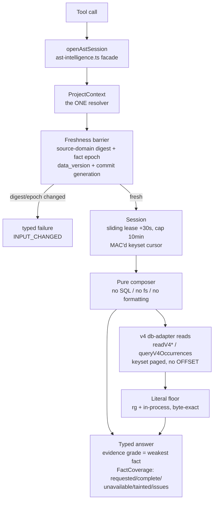

# POLARIS — System Map

*A one-page navigation aid for the AST-intelligence layer in `packages/zenith-mcp`. Verified against on-disk code on 2026-07-15, not transcribed from the plan. Plan: `docs/concepts/AST_INTELLIGENCE_SYNTHESIS.md`; latest handoff: `docs/SESSION-HANDOFF-2026-07-15.md`.*

> **Build state at map time — mid Wave 2.3.** Waves 0–1 (oracles, v4 repairs, store identity) and the Wave 2 contract freeze are **complete**. The session factory (Task 2.1) and the v4 read set (Task 2.2) are **built and proven**. Of Task 2.3, the evidence lattice, the literal floor, and the **first composer (`fileModel`) are done**; the other six question composers are stubbed — they run the full entry protocol then return a typed `unavailable` (`question_kind_unsupported`). Anything marked **(planned)** below is not yet composed. Note: `db-adapter.ts` and `polaris-v4-reads.test.js` were edited hours *after* the 01:55 handoff, so the on-disk state is slightly ahead of that document.

---

## 1. Two encoding spaces (and the bridge between them)

POLARIS deliberately keeps two coordinate systems and converts explicitly, because each downstream consumer needs a different unit:

- **UTF-16 code-unit space** — 1-based lines, **0-based UTF-16 code-unit columns**. This is what web-tree-sitter / JS strings emit, so it is what v4 *persists* (a def after an `é` stores column 22, not byte 23). *[Amended 2026-07-15, review finding F2 — was wrongly "UTF-8 byte columns" in the original plan.]*
- **UTF-8 byte space** — 0-based, half-open byte ranges. Used for **exact source slicing**, the **ripgrep / in-process literal floor**, and name ordering. `injections` persists raw `start_byte`/`end_byte`.

**Where they meet:** a caller-supplied line/column is converted **against the exact fresh bytes** before any occurrence lookup; the converter is defined against UTF-16 units. Name ordering rides SQLite's **default BINARY collation** (no `COLLATE` keyword anywhere) — UTF-8 byte order, which equals Unicode code-point order — and the keyset prefix-successor math in `db-adapter.ts` exploits exactly that property.

## 2. The fact substrate — v4 SQLite schema (`db-adapter.ts`, `LATEST_SYMBOL_SCHEMA_VERSION = 4`)

Built by a cumulative v1→v4 migration ladder. Core fact tables:

| Table | Holds |
|---|---|
| `files` | indexed-file registry: `path`, `hash`, `last_indexed` (coverage source of truth) |
| `symbols` | every declaration/reference: name, kind, type, file, **line/end_line/column**, parent, visibility |
| `edges` | reference/call edges: `container_def_id`, `referenced_name`, `reference_kind`, `callee_symbol_id` |
| `symbol_structures` | params, return, decorators, modifiers, generics, parent kind/name |
| `anchors` | doc/comment/decorator anchors tied to a symbol |
| `imports` | statement-level imports: module + `imported_names_json` |
| `import_bindings` | resolved per-name bindings: source, local/imported name, kind, type-only, line/column |
| `injections` | embedded-language spans: host/injected lang, line range **and byte range** |
| `local_scopes` | the "scopes" table: scope kind, line range, parameters, locals |

**House rule — `callee_symbol_id` is never proven.** It is legacy storage metadata only ("`resolved` here is never semantic proof"). Reads expose it as `legacyStorageState` / `legacy_heuristic`; `readV4EdgeFrontier` groups such targets **without promoting any to a real relation**.

**Five-state resolution** (contract in `intelligence/types.ts`): `resolved | ambiguous | unresolved | external | unsupported`. *(The `resolveAt` composer that emits this is planned; the type and the frontier honesty are built.)*

## 3. The seven session questions (`session.ts` → composers)

1. **`fileModel(path, q?)`** — sectioned, keyset-paged model of every fact in one file + per-section coverage. ✅ **built** (`questions/file.ts`).
2. **`locationAt(path, q)`** — every fact intersecting a point/range, innermost-first. **(planned)**
3. **`resolveAt(path, q)`** — the five-state answer for one exact occurrence + candidates. **(planned)**
4. **`queryOccurrences(q)`** — conjunctive decl/ref/import/export discovery with exact totals. **(planned; the v4 read `queryV4Occurrences` exists)**
5. **`traceRelations(q)`** — proven relation nodes + a mandatory unresolved frontier. **(planned)**
6. **`scopeModel(q)`** — directory/module/project aggregates + coverage (module domains need semantic profiles, Wave 4+). **(planned)**
7. **`contextFor(q)`** — deduped, reason-tagged ranges (default page 64). **(planned)**

## 4. Query flow — tool call → typed answer

The **cursor is a MAC'd keyset tuple** (HMAC-SHA256, process-local secret; payload = scopeKey, domainDigest, snapshotKey, queryDigest, lastCanonicalKey) — it cannot be forged to skip a range or reused across a different query/epoch. Composers are **pure**: all SQL lives in `db-adapter.ts`, all compression lives in TOON.

## 5. Invariants / house rules (the things that must never break)

- **TOON seam** — every compression decision lives in `packages/zenith-toon`; `zenith-mcp` ships *raw facts only* and never has a file named for compression. Mechanically enforced by `polaris-boundaries.test.js`.
- **Never-refuse** — no factual domain is refused for being large; the DB degrades to the global store rather than throwing. What POLARIS must always do is *report* what it does and doesn't cover.
- **Detection never writes / config never auto-written** — a detected-but-unpromoted root materializes no `.mcp` DB; the user's config file is never written uninvited.
- **No SQL `OFFSET`** — pagination is keyset/seek only (`WHERE (path,line,column,name) > (...)`), never row IDs or insertion order.
- **No non-null assertions** — enforced repo-wide by a syntax-aware AST gate (`polaris-no-non-null.test.js`).
- **Evidence grades `text < structural < binding`** — a composed answer's grade is the **weakest** of its contributing facts; it can never claim stronger evidence than it has.
- **Byte-exact literal floor** — ripgrep runs with `--no-config --no-ignore --hidden --text --encoding none` as an *optimization for the has-hits case only*. **An rg-clean zero-match is never proof of absence** (finding F1): every absence claim is re-confirmed by the in-process byte scanner, and any partial scan (byte budget or per-file bound fired, unreadable file) can return matches but **can never prove absence**.
- **Grammar ABI pins** — `grammars/.grammar-pins.json` locks specific grammars (`sql`, `vue`) to an exact commit + sha256 against the `web-tree-sitter@0.26.9` core ABI; `runtime.ts` runs an ABI-compatibility probe and skips any mismatched WASM rather than crashing the parser.

---
*Proven by: `polaris-questions-file`, `polaris-session`, `polaris-v4-reads`, `polaris-text-floor`, `polaris-basis-conservation` (+ Wave 0/1 suites). Facade frozen after Wave 2; composers 2–7 land one at a time in Task 2.3.*
