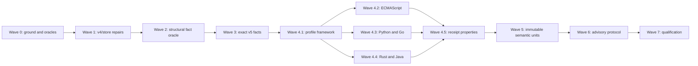

# AstIntelligence — Final Synthesis

## Synthesis Dossier

### Independent sketch (written before opening the four plans or their review)

**Thesis.** AstIntelligence should be Zenith-MCP's deterministic, question-oriented read layer over the existing content-addressed symbol database: it should turn persisted syntax facts into bounded answers without pretending that tree-sitter facts are compiler semantics. Every answer should carry the evidence, freshness state, coverage limits, and unresolved alternatives required to tell a caller not only *what Zenith thinks*, but *how far that conclusion is justified*.

**Spine.** `validated request -> project/global scope resolution -> freshness barrier -> dedicated DB read set -> deterministic composition -> evidence-bearing result`. Extraction remains exclusively in `core/indexing/extract.ts`; SQL remains exclusively in `core/db-adapter.ts`; future clients own their formatting; TOON continues to receive raw facts and own every compression decision.

**Distinctive mechanism.** Treat certainty as a structural contract, not a confidence score. Resolution uses explicit resolved/ambiguous/unresolved/external/unsupported arms, while the result envelope separately records provenance, freshness, fact coverage, pagination, safety bounds, and unresolved edges. No weighted score may promote an ambiguous candidate into a resolved answer. Deterministic preference rules may order candidates, but the returned state must still expose ties and incomplete evidence.

**Biggest risk.** The dangerous failure is a plausible-but-wrong resolution: AstIntelligence returns one credible definition or dependency after silently discarding an equally credible candidate, trusting stale rows, crossing a project boundary, or laundering a tree-sitter reference into semantic certainty. Loud absence is recoverable; false certainty propagates into edits, refactors, TOON context, and later plans.

**First decisions to lock.** (1) the symbol DB remains the only fact source and freshness completes before any rows are trusted; (2) public identities are repo-relative source coordinates plus structural descriptors, never durable SQLite row IDs; (3) the surface is derived from the complete answerable fact domain, not from today's tools; (4) methods return typed domain data only—no tool strings, compression shapes, new ranking algorithm, extraction path, or cache.

**Ground-truth calibration.** The repository already has the correct lower layers: one parse orchestrator (`core/indexing/extract.ts`), transactional persistence (`core/indexing/persist.ts`), content-addressed freshness (`ensureFreshFromContent`), disk-backed per-project SQLite indexes, typed edge resolution that intentionally leaves ambiguity unresolved, and consumer-facing DB reads in `indexed-symbols.ts`. The missing first unit is therefore an imperative query/composition layer—Zenith's bounded Layer 5—not another parser, replacement index format, or language server. Exact cross-file reachability later requires a deliberately narrow proof binder over persisted syntax facts, but never a checker or compiler surrogate. The external `Language.md` survey supports this architectural niche: tree-sitter supplies syntax rather than compiler semantics; useful code-intelligence systems expose question-oriented APIs over a synchronized semantic/index state; persistent formats trade live compiler depth for queryable, provenance-rich facts.

### Plan inventories

**ARIADNE.** Central bet: useful AST intelligence requires Zenith to build its own persistent, proof-carrying multi-language binding engine before exposing queries. Spine: expand extraction and schema (v5) -> construct language-specific project/scope/module/export models -> bind every occurrence -> stage and atomically activate a derived semantic generation (v6) -> query active resolutions and relations. Strongest pieces: its categorical truth model forbids confidence scores from becoming targets; resolved/ambiguous/unresolved/external/unsupported outcomes retain candidates and proof; its plausible-but-wrong fixtures, clean-rebuild oracle, negative-dependency reasoning, atomic activation, migration fault injection, and exact release gates are the pool's highest proof standard. Weakest ground: the spine adds two schema versions, many raw and derived tables, five language-profile implementations, a semantic identity system, a binder, re-export fixed points, and an incremental generation engine before any generally usable fact oracle exists. Its exposed query seam is narrower than the facts it proposes to persist, so downstream clients would still reconstruct unowned compositions. Load-bearing assumptions checked against the current checkout: the v4 schema, one-parse ingestion path, lossy line-oriented scope/reference facts, name-based legacy resolver, and content freshness seam are VERIFIED; the historical external v1 database snapshot and performance figures are not properties of this checkout and are not inherited. Carry forward: truth-state unions, proof/evidence, no guessed resolution, active freshness predicates, adversarial plausible-wrong fixtures, deterministic ordering, and exact gates. Reject: making v5/v6 a prerequisite for the first oracle release, compiler-scale program models, and any semantic identity that is not versioned within an immutable snapshot.

**MERIDIAN.** Central bet: AstIntelligence should be a total oracle over every fact Zenith can persist, with an evidence lattice whose weakest input limits every composed answer. Spine: repair v4 -> add exact v5 facts -> build five profiles -> derive receipt-validated immutable units -> activate one v6 manifest -> expose eight-ish question/capability surfaces plus post-edit advisories. Strongest pieces: basis conservation ("a join never upgrades evidence"), typed ignorance, proof-backed empty results, segment-localized qualified-name failures, capability state, a serious five-oracle proof program, and the review's strongest author-owned grounding. Weakest ground: it still allowed a globally unique heuristic target to remain `resolved`; its post-write advisory API had already discarded the required before-fact state; its orphaned-import join was empirically false under shadowing; its stale-edge crash contract contradicted itself; its public surface drifted; its text floor was prose without an executable contract; and its hardest waves/allowlists were delegated to prior plans. Carry forward: the evidence lattice, totality properties, directory aggregation, per-file capability truth, worked-answer precision, and verification discipline. Reject or replace: `heuristic_unique` as a resolved basis, one-shot post-write advisories, `import_bindings JOIN edges`, external-plan task incorporation, and the unfrozen method count.

**PARALLAX.** Central bet: a durable semantic model should be built as immutable content-addressed resolution units whose positive and negative lookup receipts authorize reuse, then published by one project-snapshot compare-and-swap. Spine: v5 exact facts/change log -> language profiles -> SCC units + receipts -> v6 snapshot manifest -> snapshot/overlay session -> six questions -> broad consumer cutover. Strongest pieces: the best persistence/concurrency design in the pool, explicit negative-dependency receipts, clean-rebuild equality, stable identity separation, no N+1 reads, deterministic snapshots, and a genuinely useful question face above the engine. Weakest ground: the overlay directly conflicts with the settled live-write/DB-source-of-truth law; the 60-second session cliff is arbitrary; profile receipt membership is named but not written; the global codec initially lived too high in the stack; the semantic build is far larger than the mission's initial existing-schema milestone; and the plan's own commission update reverses earlier architecture mid-document. Carry forward: immutable units, receipt-proof reuse, one manifest pointer, CAS activation, clean-vs-incremental oracle, stable semantic keys inside versioned artifacts, and the six core questions. Reject: overlay facts, absolute 60-second expiry, parity gates, caller-visible DB identities, and any cutover that treats legacy `callee_symbol_id` as semantic truth.

**SEXTAN.** Central bet: the layer's defining success is not maximum resolution rate but knowing when an answer is proved and when it is not. Spine: v4 integrity -> v5 fact sufficiency -> PARALLAX-derived semantic engine -> six-question session -> total semantic/structural/text ladder -> edit advisory proof -> cutover. Strongest pieces: the clearest epistemic product statement, explicit adoption of the settled no-overlay/ingestion-codec/sliding-lease/parity/cap/advisory laws, mandatory unresolved frontier, and disciplined refusal to use confidence scores. Weakest ground: it still traversed a "re-proven" legacy callee ID while admitting that re-proof established freshness rather than reachability; it asked the implementer to choose the stale-edge transaction; its semantic phase was "PARALLAX where sound" rather than a plan; its claimed closed allowlists were mostly absent; its text floor admitted a no-sweep branch; and its first-consumer advisory and receipt registries were doctrines rather than buildable contracts. Carry forward: the one-line epistemic law, structural frontier, context-economy principle, advisory quietness/caps, and owner-ruling ledger. Reject or replace: structural traversal of heuristic IDs, delegated transaction choice, patched external phase text, and an rg-dependent definition of totality.

### Feature-level comparison

Scores are against the current checkout, Mission.md, AGENTS.md, the review's settled law, and the requirement that the resulting document be implementable without inventing a load-bearing decision. There is intentionally no aggregate score.

The owner's later direction supersedes one Mission.md planning heuristic: the method set is **not** minimized around current consumers, because those consumers will be rebuilt after this layer. It is minimized around the complete authoritative fact domain instead. Mission.md's database, extraction, boundedness, internal-library, no-LSP, no-formatting, and TOON boundaries remain in force.

| Dimension | ARIADNE | MERIDIAN | PARALLAX | SEXTAN |
|---|---|---|---|---|
| Existing-schema first milestone | **2** — the query layer waits behind v5/v6 | **6** — repairs v4 first but withholds the face until v6 | **3** — v5/v6 are prerequisites | **6** — structural tier is designed, but sequencing still withholds it |
| Question-oriented product surface | **3** — mostly fact-shaped semantic reads | **9** — broad, typed, worked examples | **9** — six coherent questions | **8** — coherent six-question face, less fully specified |
| Proof-gated resolution | **9** — strongest original truth vocabulary | **6** — labels heuristic targets but still resolves them | **9** — semantic bindings carry proof | **6** — admits heuristic graph traversal under a warning |
| Basis/provenance conservation | **8** — proof-rich, no general join law | **10** — weakest-input conservation is explicit and property-tested | **8** — receipts/proofs strong, conservation implicit | **8** — evidence-first but not algebraically enforced |
| Typed totality and honest absence | **8** — uncertainty is data | **10** — best result algebra and empty-proof model | **8** — strong completeness envelope | **8** — strong doctrine, incomplete floor contract |
| Freshness and unsaved bytes | **8** — generation activation is strong, no usable content path | **8** — live content path, but multi-file failure contract absent | **7** — exact overlay safety conflicts with settled DB law | **8** — live content path, failure contract absent |
| Incremental invalidation | **10** — negative dependencies + clean oracle | **10** — receipts/change log/clean oracle | **10** — core design strength | **9** — inherits the right destination but delegates details |
| Concurrency/snapshot consistency | **8** — atomic generations, more mixed-epoch risk | **10** — one immutable manifest and CAS | **10** — originating design | **9** — inherits without native task detail |
| Advisory correctness/buildability | **2** — not the product seam | **3** — before-state and name-join are unsound | **2** — not designed | **5** — correct doctrine, missing executable API/proof path |
| Global fallback and identity | **1** — project-only | **7** — correct codec intent, migration/init incomplete | **7** — correct namespace, initially routing-only | **7** — correct intent split across phases |
| Receipt-domain specificity | **7** — best canonical key vocabulary, profile membership still incomplete | **5** — delegates membership to builders | **5** — receipts precise, member domains not | **5** — promises tables but does not supply them |
| Total literal floor | **1** — absent | **4** — prose-only and overclaims method coverage | **2** — absent | **5** — names rg, lacks universal fallback |
| Standalone task completeness | **9** — exhaustive despite wrong scope | **6** — substantial but delegates Waves 2–4 | **9** — detailed native tasks | **4** — hardest work incorporated "where sound" |
| Closed allowlists | **9** — generally explicit | **4** — promised but missing/incorrect in key waves | **9** — strong per-task lists | **3** — promise not matched by text |
| Database/migration proof | **10** — strongest migration/fault suite | **10** — carries it forward | **10** — file-backed/fault/CAS proofs | **9** — right gates, less native detail |
| Operational scope control | **3** — compiler-adjacent multi-year build before value | **6** — useful v4 wave, still a large stack | **5** — coherent but broad | **6** — concise, yet hidden work remains broad |
| Current-code grounding | **7** — deep, but historical inputs external | **10** — strongest receipts/unchecked register | **8** — strong post-merge grounding | **6** — relies too heavily on inherited audit claims |

### Forks and rulings

1. **Composition-only v4 layer or semantic engine first?** Ruling: ship a fully useful v4 AstIntelligence milestone before any additive semantic schema, then deepen the same frozen face. This honors Mission.md's existing-schema requirement and creates a verifiable oracle milestone without letting semantic substrate work hide it, while retaining the review-mandated immutable-unit destination. Structural answers never masquerade as binding answers.
2. **Can a weaker basis legalize a resolved target?** Ruling: no. `resolved` is structurally constructible only with a `BindingProof`; heuristic uniqueness, name matches, and legacy callee IDs are candidate/frontier evidence. MERIDIAN's basis lattice remains, but its resolved variant excludes weak bases.
3. **Mutable generations or immutable units?** Ruling: PARALLAX's immutable content-addressed units plus one snapshot manifest. Semantic keys persist inside versioned units and are interpreted only under their snapshot/engine/profile contract; SQLite row IDs never cross the facade.
4. **Negative dependency ledger or change-name invalidation?** Ruling: both at their proper layers. v4 gets one atomic affected-name clear-and-reresolve transaction for compatibility correctness; v6 reuse is authorized only by recomputed receipt domains. The change log narrows work but never proves reuse.
5. **Overlay or live content facts?** Ruling: no overlay. Exact content is ingested through the sanctioned content freshness path. A multi-file transition may leave successfully ingested live facts if a later file fails, but no session opens over a partial basis; the failure reports exactly which paths became current and which did not. The next disk freshness check self-corrects unsaved state.
6. **A caller-derived menu or a fact-domain oracle?** Ruling: the current tool fleet is not an input to the API design and is not a migration target. Exactly seven orthogonal session questions cover the complete authoritative fact domain: `fileModel`, `locationAt`, `resolveAt`, `queryOccurrences`, `traceRelations`, `scopeModel`, and `contextFor`. File capability/coverage is carried by every answer rather than exposed as a separate state query. Edit advice is a separate two-stage lifecycle protocol, not an eighth query.
7. **One-shot or two-stage advisories?** Ruling: capture immutable before facts while they are fresh, then evaluate against current after facts after the write's normal persistence. Never re-ingest old bytes. Import advice requires an unchanged exact reference proven before to bind through the removed import and proven after to remain an unresolved call; a name edge is insufficient.
8. **What does "total" mean?** Ruling: the API is total over validated inputs; every method returns a typed answer or typed operational failure. A literal byte floor applies only to name/definition discovery. It has an in-process bounded scanner when rg is absent. It never pretends text can answer containment or graph questions.
9. **Where does global identity live?** Ruling: in the ingestion address. `ProjectContext` selects the store and the longest containing allowed root; every file key is encoded before reads/writes. Existing global symbol rows are detected. They are rewritten only when one root can be proved and the transaction is collision-free; otherwise they are preserved but quarantined from scoped reads with a typed migration issue.
10. **What validates the layer before the rebuilt fleet exists?** Ruling: a reference-client harness exercises the full session and two-stage advisory protocols without modifying any current tool. Acceptance is fact-ledger completeness, fixture truth, proof conservation, and clean/incremental equivalence—never legacy output parity. The future tool fleet consumes the finished layer afterward.

### Universal blind spots in the four plans

- None made `resolved => binding proof` a TypeScript construction rule while simultaneously preserving a weaker candidate basis for useful structural evidence.
- None supplied a sound, two-stage advisory contract with an unchanged-range map linking exact pre-edit semantic references to post-edit references.
- None wrote all six per-profile receipt-domain registries into the plan at the same precision as the receipt row.
- None made the existing-schema query layer an independently releasable milestone without sacrificing the eventual immutable semantic substrate.
- None gave global initialization a three-way branch: no legacy rows, provably migratable rows, or ambiguous rows preserved but excluded.
- None distinguished total typed answers from the narrower set of questions for which a byte sweep can prove absence.
- None specified the multi-file live-content failure state: prior successful ingestions stay authoritative, but the session is not constructed from a partial basis.
- None made an exhaustive fact ledger the release oracle or gave every enumerable factual answer snapshot-bound keyset continuation, so every plan could silently strand a new fact family or truncate a large answer.

### Closure of the review's eight additional requirements

| Review precondition | POLARIS closure | Build and proof locus |
|---|---|---|
| 1. `resolved` requires binding proof | The resolved union arm alone carries one target, `BindingBasis`, and `NonEmpty<BindingProofStep>`; heuristic IDs/names/text remain candidate/frontier evidence | Public contracts; Tasks 2.1, 4.5, 5.1-5.2, 7.1; compile-time and plausible-wrong oracles |
| 2. Advisory preserves exact before facts and correct category | Opaque capture runs after pre-byte freshness; evaluation runs after the write/freshness using a verified byte map and exact reference binding; unreachable means after unconditional return only | Two-stage advisory contract; Tasks 6.1-6.4; neutral reference-client and adversarial suites |
| 3. Stale-resolution repair is crash atomic | Old/new affected names, clear, replacement, and re-resolution share one outer transaction; no committed clear can remain owed | Repaired-v4 model; Task 1.3; statement-level fault injection and clean oracle |
| 4. Receipt registries and 512 cap are explicit | Shared lexical plus per-profile configuration/module/export/member/prelude membership are written in full; 512 is provisional and freezes at p99 with 4x headroom | Receipt-domain registries; Tasks 4.1-4.5 and 7.2; six transition classes and capacity report |
| 5. Plan is standalone with closed allowlists | All eight waves and all 36 tasks are expanded here; every task has a closed create/modify allowlist plus an imperative implementation/test contract, and every wave has an exit gate | Implementation waves and dependency map; Task 7.4 diff audit |
| 6. Total floor is executable and regex is honest | Exact identifier discovery has equivalent ripgrep and bounded in-process paths; absence requires complete domain proof; regex returns typed unsupported | Literal-floor contract; Tasks 2.3-2.4 and 7.1 |
| 7. Surface and identity are reconciled | Seven-query domain algebra is frozen; semantic keys live in immutable units under content-derived snapshot keys; SQLite IDs never enter public identity | Public contracts and v6 model; Tasks 2.1, 5.1, 5.3, 7.1 |
| 8. Global initialization/cohabitation is explicit | Symbol and stash schemas initialize together; unprefixed rows are absent, provably collision-free migrated, or preserved/quarantined | Store-addressing contract; Tasks 0.3, 1.4, 7.4; file-backed rollback/cohabitation tests |

### Spine declaration

The synthesized spine is new, named **POLARIS**:

`ProjectContext-scoped store address -> mandatory content/disk freshness -> v4 evidence-preserving fact oracle -> exact v5 fact expansion -> profile-owned receipt domains -> immutable resolution units -> project snapshot CAS -> the same proof-gated domain-complete session -> two-stage post-edit advisory`.

The first four nodes are independently releasable. The semantic nodes deepen evidence without changing the public face. The compatibility rule is strict: v4 structural candidates and unresolved frontiers keep their meaning after v6; only a proof-bearing semantic binding may populate the resolved arm. The completeness rule is equally strict: every registered persistence family has a ledger owner, every requested domain reports coverage, and every supported enumerable answer can be paged to exhaustion. The design does not require TOON, tool formatting, or compiler semantics to move into AstIntelligence.

### Cherry-pick registry

| Element | Source | Final form in POLARIS | Why it stays |
|---|---|---|---|
| Five-state resolution vocabulary | ARIADNE | Proof-gated discriminated union; `resolved` alone carries target + nonempty binding proof | Prevents confidence from becoming truth |
| Worst-failure ordering | ARIADNE | Release invariant and fixture oracle | Keeps plausible-wrong above loud uncertainty |
| Five correctness oracles and fault matrix | ARIADNE | Applied to v4, v5, v6, advisory, and migration stages | Strongest evidence standard in the pool |
| Immutable units, lookup receipts, snapshot CAS | PARALLAX | v6 semantic substrate after a released v4 face | Best concurrency/reuse model without delaying initial value |
| Six core questions | PARALLAX / SEXTAN | Recut into seven orthogonal domain queries: file, location, occurrence, binding, relation, scope, context | Preserves their useful question shape while covering every authoritative fact family |
| No N+1 / chunked reads | PARALLAX | Set-oriented adapter contract and query-plan gate | Performance is part of correctness |
| Basis conservation | MERIDIAN | Closed evidence lattice + property test + resolved proof gate | Best novel contribution; corrected at the type boundary |
| Typed ignorance and proof-backed empty | MERIDIAN | Total result envelope; byte-floor proof only where valid | Makes absence useful without overclaiming |
| Total oracle ambition | MERIDIAN + owner direction | Exhaustive authoritative fact ledger whose rows own public projections and coverage rules | Defines completeness from facts rather than legacy callers |
| Exhaustible bounded answers | POLARIS synthesis | Snapshot/domain-bound keyset continuations for every enumerable query | Reconciles complete factual answers with bounded memory/runtime |
| Directory aggregation | MERIDIAN | Generalized to bounded directory/module/project `scopeModel` | Prevents every future caller recomposing N files and avoids baking in one tool's directory concept |
| Segment-localized qualified-name failure | MERIDIAN / Language.md | `resolvedThrough` and `stoppedAt` in unresolved outcomes | Gives a one-round correction without verbose proof leakage |
| Epistemic one-line law | SEXTAN | Governing product invariant | Concise decision test for every implementation choice |
| Mandatory unresolved frontier | SEXTAN | Every structural/name-only relation remains frontier forever | Prevents numeric-ID laundering |
| Sliding lease and cap settlement | SEXTAN / review rulings | +30 s successful-call slide, 10 min hard cap; all provisional caps measured | Removes arbitrary cliffs and silent truncation |
| Two-stage advisory | Review synthesis | Opaque pre-edit capture + post-edit evaluation using exact semantic bindings and a verified change map | Supplies a sound lifecycle contract to the rebuilt edit client without coupling to today's implementation |
| Atomic v4 stale-edge repair | Review live verification | Clear + resolve affected names in the same outer transaction | Removes the false self-heal claim |
| Universal literal scanner fallback | Review live verification | Bounded in-process exact scan when rg is absent | Makes absence proof independent of an optional executable |
| Semantic profiles as full language engines | ARIADNE/PARALLAX | **Narrowed** to binding/profile rules over explicitly persisted syntax facts; no checker, inference, or daemon | Necessary for proof, bounded below compiler semantics |
| Active mutable generations | ARIADNE | **Rejected** in favor of immutable units + one manifest | Avoids mixed epochs and redundant state machines |
| Overlay FactView | PARALLAX | **Rejected** | Conflicts with DB source-of-truth and settled live-write law |
| `heuristic_unique` resolved target | MERIDIAN | **Rejected**; candidate/frontier only | A label cannot make an unreachable target true |
| `import_bindings JOIN edges` advisory | MERIDIAN | **Rejected** | Shadowing counterexample proves false positives; edges lack ranges |
| Structural traversal of legacy callee IDs | SEXTAN | **Rejected** | Reconsideration proves freshness, not reachability |
| rg-only total floor | SEXTAN | **Rejected** | Optional executable cannot underwrite totality |
| Legacy agreement threshold | PARALLAX | **Rejected entirely**; fixture truth and fact-ledger completeness are the only answer oracles | Correct answers must not be shaped by tools that will be replaced |

---

# THE PLAN — POLARIS

## Outcome

POLARIS builds AstIntelligence as Zenith-MCP's one internal, client-agnostic oracle over the symbol database. Its public face is derived from the facts Zenith can authoritatively acquire and prove, not from the questions today's tools happen to ask. It has one public face, one fact authority, and two independently releasable depths:

1. **POLARIS Structural** works on repaired schema v4. It centralizes routing, freshness, complete projection of every v4 fact family, containment, occurrence discovery, scope aggregation, bounded context, and honest relationship frontiers. It is independently useful on the existing schema, with no semantic cache and no compiler claims.
2. **POLARIS Semantic** additively persists exact v5 facts and immutable v6 semantic units. It expands the same closed oracle with exact occurrences, scopes, exports, signatures, diagnostics, explicit relations, binding proof, negative-dependency receipts, and snapshot consistency. It does not add a caller-specific method.

The product rule is SEXTAN's strongest sentence made executable: **POLARIS need not always know the right answer; it must know and report when it does and does not.** In code, that means a resolved target cannot exist without a nonempty binding proof, weak evidence can order candidates but can never resolve them, and a composed answer can never claim a stronger evidence grade than its weakest contributing fact.

The acceptance client is a purpose-built reference harness, not a current MCP tool. It proves that a future edit client can capture advice before a write and evaluate it after normal post-write freshness; advice is facts-only, delta-scoped, capped, deduplicated, delivered once, and never blocks or gates the simulated write. Current tool output, behavior, and parity are outside the release oracle because those tools will be rebuilt on this layer.

## Verified implementation ground

Ground is the current `d7f086b68f4bf7355376d21432e652fd4dc2aa0a` checkout. The following claims were re-read in this checkout; the prior judgment's Node-26 harness results are accepted as supplied evidence but were not rerun during this synthesis.

- `core/indexing/extract.ts:50-239` performs one parse and emits symbols, parent links, structures, anchors, statement imports, binding imports, injections, local scopes, and raw name edges. Its `name:kind:line` key at line 78 still drops repeated same-line references.
- `core/indexing/persist.ts:18-95` writes one file in a transaction and is the sole persistent fact path.
- `core/db-adapter.ts:95-335` is schema v4, but base DDL/ad-hoc mutations run before the schema version is read at line 186. `files` still uses `INSERT OR REPLACE` at lines 441-446.
- `core/indexing/resolve.ts:4-16,144-170,209-224` resolves a unique same-file definition or globally unique name and only scans null `callee_symbol_id` rows. It proves neither import/export reachability nor recovery after a competitor appears.
- `core/symbol-index.ts:196-239` indexes supplied content bytes correctly; `245-301` silently truncates a walk and then purges every unvisited row; `358-381` runs the resolver only after a hash miss. Same-byte freshness cannot heal a committed clear.
- `core/indexed-symbols.ts:79-193` correctly centralizes several DB-backed reads, but qualified containment is reconstructed by line ranges instead of persisted parent IDs and no global `ProjectContext` route exists.
- `core/project-context.ts:96-105,239-301,400-402` routes any unregistered allowed path to the global store, while that global store currently initializes stash tables only.
- `tools/edit_file.ts:54-108` demonstrates that Zenith's existing edit lifecycle has a viable pre-bytes/post-freshness seam. This is repository evidence for the lifecycle contract only; POLARIS does not integrate with, preserve, or use the current tool as an acceptance oracle.
- `core/tree-sitter.ts:1-47` is the sanctioned parse-only barrel and already exports `checkSyntaxErrors`; it does not expose fact extractors.
- `core/compression.ts:1-126` is raw-fact transport into one `compressFile` call. POLARIS must not add shaping, ranking, budgeting, formatting, or post-processing there.

## Unchecked register

- No real historical `.mcp/symbols.db` or `~/.zenith-mcp/global-stash.db` was supplied or opened. Migration design is grounded in seeded v1/v4 shapes; real-copy rehearsal remains unexecuted until the owner supplies a copy.
- Proposed v5/v6 tables, profiles, receipt registries, immutable units, and the public facade do not exist yet. They are implementation contracts, not claims about current behavior.
- Large-scale latency/RSS, 1,000-edit clean equivalence, 512-file SCC, CAS contention, and p99 cap values are unmeasured until Waves 0 and 7 run their harnesses.
- The permission-sensitive three-test exception recorded by the judgment still needs a permission-faithful host.
- No assertion in this plan depends on current tool output parity. The only current-tool reference is evidence that a before/after lifecycle seam has existed; the reference client supplies the actual acceptance proof.

## Product boundary

POLARIS owns:

- store selection and scope identity supplied by `ProjectContext`;
- mandatory disk/content freshness and a non-forgeable operation basis;
- dedicated, set-oriented DB reads;
- deterministic question composition;
- evidence grade, proof, ambiguity, coverage, keyset continuation, safety-bound state, and operational failure;
- exact binding profiles below the type-checker boundary;
- immutable derived units, receipt-based reuse, and snapshot publication;
- two-stage edit-advisory capture/evaluation.

POLARIS does not own:

- MCP schemas or a new MCP tool/mode;
- source rendering, tool strings, result serialization, edit authorization, or write gating;
- tree-sitter fact extraction outside `core/indexing/extract.ts`;
- production SQL outside `core/db-adapter.ts`;
- type inference, overload selection, data-flow narrowing, dynamic dispatch, macro/trait solving, classpath analysis, or compiler/LSP services;
- generic search ranking, BM25/BMX, fuzzy selection, or confidence scores;
- TOON fact shaping, ranking, budget, usefulness, markers, output, or `compressFile` behavior;
- a generic query-result cache. v6 artifacts are versioned, rebuildable semantic state required for cross-file proof consistency, not cached facade responses.
- migration, compatibility shims, output parity, or formatting for the current tool fleet. Those clients are rebuilt only after POLARIS is complete.

## Architecture

```text
validated caller request
        |
        v
ProjectContext.getIntelligenceStore(anchor)
  -> one DB, mode, scope root/key, path codec
        |
        v
freshness factory
  disk -> ensureIndexFresh
  content -> ensureFreshFromContent (live DB truth; no overlay)
        |
        +---------------- schema v4 ----------------+
        | dedicated adapter reads                  |
        | structural composition + literal floor   |
        +-------------------------------------------+
        |
        +---------------- schema v5/v6 -----------------------------+
        | exact occurrences/scopes/exports/diagnostics/change log   |
        | profile receipt domains -> immutable semantic units        |
        | complete manifest -> compare-and-swap active snapshot      |
        +------------------------------------------------------------+
        |
        v
opaque AstSession
  closed fact-domain oracle -> typed answer + evidence + coverage
        |
        +-> future clients select and format projections
        +-> reference lifecycle proves edit baseline / post-write evaluation
        +-> TOON remains a separate raw-fact consumer
```

## Locked decisions

### Truth and identity

1. **Resolved means proved.** A `resolved` resolution contains a `BindingBasis`, one target, and a nonempty `BindingProof`. TypeScript cannot construct it from `heuristic_name`, `legacy_callee_id`, `text_match`, or `line_proximity` evidence.
2. **Weak evidence remains useful without becoming truth.** Structural/name/text evidence orders candidates and populates frontiers. It never produces a traversable call/import/export relation.
3. **Basis conservation is mandatory.** Evidence grades are `text < structural < binding`. Every composer returns the minimum grade of the facts used. The only legal exception is an answer whose subclaims are separately graded; no aggregate field may imply a stronger grade.
4. **Ambiguity is not ordering.** Deterministic ordering exists for presentation. If more than one candidate survives the proof rules, the status remains `ambiguous` regardless of order.
5. **Identity is versioned, not database-local.** Semantic keys persist inside immutable units and are meaningful only with `(scopeKey, snapshotKey, engineVersion, profileId, profileVersion)`. `snapshotKey` and `unitKey` are content-derived hashes, never SQLite row IDs. Auto-increment values may exist only as internal change-log high-water marks and never cross the facade or enter semantic identity.
6. **Ordinary ignorance is data.** Unsupported languages, missing facts, no matches, external modules, dynamic receivers, incomplete walks, and unresolved names are typed answers. Failure codes are reserved for invalid requests, expired sessions, schema/store failures, cancellation, and concurrent input changes.

### Surface

7. **Exactly seven orthogonal session questions ship:** `fileModel`, `locationAt`, `resolveAt`, `queryOccurrences`, `traceRelations`, `scopeModel`, and `contextFor`. Their union covers every row family in the authoritative fact ledger; adding a fact family without assigning it to at least one query is a contract failure.
8. Capability/state is not a method. Each answer includes `FactCoverage { requested, complete, unavailable, tainted, issues }`, and file-bearing sections additionally carry their source hash and parse coverage.
9. Edit advice is not an eighth question. The facade separately exports `captureEditBaseline` and `evaluateEditAdvisories` because they form a lifecycle protocol around a write.
10. No method returns tool text, whole files, body slices, or newly rendered source. Exact declared syntax fields that are themselves persisted facts (for example a declared return-type spelling) may be projected as facts. Context returns reason-tagged ranges; future clients decide what source to read and render.
11. No public `assumeFresh`, caller-built basis, bare DB handle, production `queryRaw`, parser node, or mutable semantic artifact exists.

### Freshness and sessions

12. A session is constructed only after its requested domain passes a disk or exact-content freshness transition. The basis records the canonical domain digest/count and a digest/count for caller-supplied content; file-bearing answers carry their own exact source hashes.
13. Content mode writes through the normal DB ingestion path. There is no overlay, proposed state, or alternate fact authority.
14. All content files in one open request must route to the same store/scope. They are processed in canonical store-key order. If file N fails after files 1..N-1 succeeded, those successful live facts remain authoritative; no session is returned, and the failure names `updated[]`, `unchanged[]`, and `failed`. Nothing rolls the DB backward.
15. The session lease is checked at method entry. A successful method call slides expiry by 30 seconds but never beyond `openedAt + 10 minutes`. Time affects only whether a session may answer, never answer contents or ordering.
16. Structural sessions pin a canonical source-domain digest over sorted in-scope `(storeKey,present|unreadable|unsupported,sourceHash-or-versioned-sentinel)` members plus an internal fact epoch derived from SQLite `data_version` and the connection's outer-commit generation. Both are revalidated at every query/page entry. This detects domain membership changes, external commits, and same-connection fact-only rewrites even when source bytes are unchanged. The epoch is intentionally not public identity. The epoch check and all DB reads for one phase execute in one short SQLite read transaction; no transaction spans an `await` or survives the call. The literal floor captures its domain/epoch in phase one, scans outside the transaction, then opens a second short transaction and discards the scan with `INPUT_CHANGED` unless digest/epoch still match. Semantic sessions additionally pin one active manifest. Every semantic read names that snapshot explicitly; it never follows a later active pointer. A changed digest/epoch produces `INPUT_CHANGED`; no cursor crosses epochs.

### Scope and global storage

17. `ProjectContext` is the only production routing authority. Intelligence never reruns git, marker, or registry discovery.
18. Project store keys are slash-normalized repo-relative paths. Global keys are `g/<sha256(canonicalAllowedRoot)>/<allowed-root-relative-slash-path>`.
19. The codec is an ingestion invariant: `indexFile`, `indexDirectory`, `ensureIndexFresh`, `ensureFreshFromContent`, persistence, purge, and every AstIntelligence adapter read receive the same `IndexAddress` object. Code never derives a DB key with an ad-hoc `path.relative` after routing.
20. The longest containing allowed root owns a global anchor. A global query never sweeps another allowed root and never claims project/profile completeness.
21. Global initialization first fixes future-schema inspection, then initializes symbol and stash schemas idempotently. Unprefixed historical symbol rows take one of three explicit paths: none -> proceed; one provable root and collision-free mapping -> transactional rewrite; ambiguous root or collision -> preserve rows, exclude them from scoped reads, and report `legacy_global_scope_ambiguous`.

### Bounds and determinism

22. Structural bounds fixed by correctness stay locked: ancestry depth 64, relation depth 1-5 (default 1), SQL ID chunks 100, persistence batches 250.
23. Safety bounds are provisional: source file bytes 16 MiB; workspace files 5,000; text-floor bytes 64 MiB; relation traversal nodes 500; semantic unit files 512; retained inactive snapshots 7; retention age 24 h. Page maxima are provisional: candidates 24; file facts 500; occurrences 200; scope groups 200; context ranges 64. Wave 7 records observed p99. Count/byte/page limits freeze at `max(provisional, nextPowerOfTwo(4 * observedP99))`; retention count uses simultaneous pinned/in-flight snapshots, while retention age uses four times the p99 build-plus-hard-session lifetime rounded to an hour. A retained provisional limit must itself provide at least 4x observed-p99 headroom.
24. Every enumerable answer uses snapshot/domain-bound keyset continuation. Reaching a page maximum sets `page.exhausted:false` and returns a cursor; it is not truncation or partial coverage. Following valid cursors to exhaustion yields each canonical fact exactly once.
25. Hitting a safety bound returns `partial` plus a named issue. It never purges unvisited data and never returns a proof-backed complete empty answer for an incompletely searched domain.
26. Canonical orders are: sections by the closed enum order declared in the public contract; files by store key; positions by `(startByte,endByte,kind,name)`; candidates by `(proofGrade desc, qualifierVerified desc, sameFile desc, nearDistance asc null-last, path,line,column,handle.stableKey)`; relations by `(kind,sourceKey,targetKey)`; issues by enum then path/range. Row IDs and insertion order never affect factual data. Canonical oracle digests exclude lease timestamps and the opaque cursor encoding itself, but include the decoded query/last-key position and concatenated page data.

### Repository boundaries

27. `core/indexing/extract.ts` remains the only production fact-extraction orchestrator. New ingestion-only tree-sitter modules are private and imported only there.
28. All new SQL is a named `db-adapter.ts` function with the SQL in its doc comment. Multi-row reads are set-oriented or chunked; no per-candidate SQL loops.
29. New validation schemas are strict. Any existing schema touched by a POLARIS integration task is made strict in that same task.
30. No new or touched TypeScript non-null assertion is permitted. Wave 1 removes the current production assertions so the final repository gate is global rather than diff-only.
31. No file under `packages/zenith-toon` changes. The MCP compression seam remains raw facts in, exact returned string/null out; global store keys are decoded to the scope-relative path before any raw `facts.path` transport.
32. Existing `indexed-symbols.ts` behavior is reused only when its dedicated adapter-backed read already preserves POLARIS identity, coverage, and ordering. Otherwise the shared SQL moves into a named adapter read and POLARIS composes it directly. Legacy helper output is never a behavioral oracle or a wrapper layer.

## Public contracts

All public types live in `packages/zenith-mcp/src/core/intelligence/types.ts` and are re-exported only by `ast-intelligence.ts`. Internal profile/unit/database types are not part of the facade.

```ts
export type EvidenceGrade = 'text' | 'structural' | 'binding';

export type SemanticNamespace =
    | 'value' | 'type' | 'module' | 'package' | 'label' | 'macro' | 'unknown';

export type SourcePosition =
    | { kind: 'byte'; byte: number }
    | { kind: 'line_column'; line: number; column: number };

export interface ExactSourceRange {
    precision: 'byte';
    startByte: number;
    endByte: number; // half-open
    startLine: number;
    startColumn: number;
    endLine: number;
    endColumn: number;
}

export type SourceRange = ExactSourceRange | {
    precision: 'line';
    startLine: number;
    startColumn: number | null;
    endLine: number; // inclusive
};

export type BindingBasis =
    | 'declaration_self'
    | 'lexical_scope'
    | 'explicit_import'
    | 'explicit_reexport'
    | 'qualified_namespace'
    | 'direct_member'
    | 'language_global';

export type CandidateBasis =
    | BindingBasis
    | 'exact_declaration'
    | 'parent_containment'
    | 'heuristic_name'
    | 'text_occurrence';

export interface BindingProofStep {
    kind: 'declaration' | 'scope' | 'module' | 'import' | 'export'
        | 'reexport' | 'member' | 'prelude';
    from: string;    // stable handle/module/scope key
    to: string;      // stable handle/module/scope key
    factKey: string; // stable persisted fact key
}

export type NonEmpty<T> = readonly [T, ...T[]];

export interface SnapshotIdentity {
    scopeKey: string;
    snapshotKey: string;
    engineVersion: number;
    profileSetHash: string;
}

export type SymbolHandle =
    | { kind: 'semantic'; stableKey: string; semanticKey: string;
        snapshot: SnapshotIdentity; profile: { id: string; version: number } }
    | { kind: 'fact'; stableKey: string; factKey: string;
        snapshot: null; profile: null }
    | { kind: 'text'; stableKey: string; textKey: string;
        snapshot: null; profile: null };

export interface LocatedSymbol {
    handle: SymbolHandle;
    path: string;                      // scope-relative, never absolute and never a SQLite id
    name: string;
    qualifiedName: string;
    kind: string;
    range: SourceRange;
    candidateBasis: CandidateBasis;
    parentChain: readonly string[];    // stable fact/semantic keys, never DB IDs
    parentChainSource: 'parent_symbol_id' | 'exact_scope' | 'line_fallback' | 'none';
}

export type ProvableSymbolHandle = Exclude<SymbolHandle, { kind: 'text' }>;
export type ResolvedLocatedSymbol = LocatedSymbol & { handle: ProvableSymbolHandle };

export type ResolutionAnswer =
    | {
        status: 'resolved';
        target: ResolvedLocatedSymbol;
        basis: BindingBasis;
        proof: NonEmpty<BindingProofStep>;
        candidates: readonly [];
        resolvedThrough: number;
        stoppedAt: null;
      }
    | {
        status: 'ambiguous';
        target: null;
        basis: null;
        proof: readonly BindingProofStep[];
        candidates: NonEmpty<LocatedSymbol>;
        resolvedThrough: number;
        stoppedAt: number | null;
      }
    | {
        status: 'unresolved';
        target: null;
        basis: null;
        proof: readonly BindingProofStep[];
        candidates: readonly LocatedSymbol[];
        reason: 'not_declared' | 'not_visible' | 'module_not_found'
            | 'namespace_mismatch' | 'incomplete_facts' | 'parse_tainted';
        resolvedThrough: number;
        stoppedAt: number | null;
      }
    | {
        status: 'external';
        target: null;
        basis: null;
        proof: readonly BindingProofStep[];
        candidates: readonly [];
        reason: 'external_module' | 'external_prelude' | 'outside_workspace';
        resolvedThrough: number;
        stoppedAt: number | null;
      }
    | {
        status: 'unsupported';
        target: null;
        basis: null;
        proof: readonly [];
        candidates: readonly LocatedSymbol[];
        reason: 'unsupported_language' | 'unsupported_construct'
            | 'requires_type_information' | 'global_structural_only';
        resolvedThrough: number;
        stoppedAt: number | null;
      };
```

All public lines are 1-based. Columns are 0-based UTF-8 byte columns, matching tree-sitter and current persisted columns. Byte offsets are 0-based and ranges are half-open. A v4 fact without byte precision uses only the `precision:'line'` arm; no composer invents byte offsets from line spans. A position supplied as line/column is converted against the exact fresh bytes before any v5/v6 occurrence lookup.

`resolved` has no weak basis variant. A compile-time constructor test must prove that a candidate carrying `heuristic_name`, `legacy_callee_id` (internal only), `text_occurrence`, or a text handle cannot satisfy the resolved branch or a proven relation endpoint.

```ts
export type CoverageIssue =
    | 'incomplete_cap'
    | 'incomplete_walk'
    | 'incomplete_facts'
    | 'parse_tainted'
    | 'global_structural_only'
    | 'legacy_global_scope_ambiguous'
    | 'unresolved_frontier'
    | 'safety_cap_candidates'
    | 'safety_cap_file_model'
    | 'safety_cap_scope_model'
    | 'safety_cap_relations'
    | 'safety_cap_context'
    | 'text_floor_partial'
    | 'semantic_pending'
    | 'semantic_unit_too_large'
    | 'source_file_too_large'
    | 'corrupt_fact_repaired';

export interface SessionBasis {
    scopeKey: string;
    scopeMode: 'project' | 'global';
    evidenceCeiling: EvidenceGrade;
    sourceDomain: {
        digest: string;
        fileCount: number;
        contentDigest: string | null;
        contentFileCount: number;
    };
    snapshot: SnapshotIdentity | null;
    coverage: readonly CoverageIssue[];
    openedAt: number;
    expiresAt: number;
    hardExpiresAt: number;
}

export type UnavailabilityReason =
    | 'path_outside_scope'
    | 'unsupported_language'
    | 'question_requires_binding'
    | 'question_requires_position'
    | 'regex_unsupported'
    | 'question_kind_unsupported';

export type OperationalFailureCode =
    | 'FUTURE_SCHEMA'
    | 'STORE_CORRUPT'
    | 'FRESHNESS_FAILED'
    | 'INPUT_CHANGED'
    | 'SESSION_EXPIRED'
    | 'SESSION_CLOSED'
    | 'CANCELLED'
    | 'INVALID_QUERY';

export interface CoveredAnswer {
    coverage: FactCoverage;
}

export interface OperationalFailure {
    code: OperationalFailureCode;
    retryable: boolean;
    detail: string;
    correction: 'reopen_session' | 'register_project' | 'narrow_scope'
        | 'supply_position' | 'retry' | 'repair_store';
}

export type QueryResult<T extends CoveredAnswer> =
    | { status: 'complete' | 'partial'; basis: SessionBasis; data: T; issues: readonly CoverageIssue[] }
    | { status: 'unavailable'; basis: SessionBasis; reason: UnavailabilityReason; issues: readonly CoverageIssue[] }
    | { status: 'failed'; basis: SessionBasis | null; failure: OperationalFailure };

declare const continuationCursorBrand: unique symbol;
export type ContinuationCursor = string & {
    readonly [continuationCursorBrand]: true;
};

export interface PageRequest {
    limit?: number;
    after?: ContinuationCursor;
}

export interface PageInfo {
    returned: number;
    total: { kind: 'exact'; value: number } | { kind: 'lower_bound'; value: number };
    exhausted: boolean;
    next: ContinuationCursor | null;
}
```

`ContinuationCursor` is an opaque, session-authenticated keyset cursor. Its canonical payload is `(scopeKey, sourceDomain.digest, snapshotKey|null, queryDigest, lastCanonicalKey)` and its MAC uses a process-local session secret; it cannot be forged into skipping a range. The query digest covers the strict normalized question and page limit but excludes `page.after`. The cursor is accepted only by the emitting live session and byte-identical normalized question; the session separately verifies its internal fact epoch. A MAC/basis/query mismatch returns `INVALID_QUERY`; a changed structural digest/epoch returns `INPUT_CHANGED`. Pagination never uses SQL `OFFSET`, row IDs, or insertion order. With complete coverage, `exhausted:false` always has a non-null next cursor and `exhausted:true` has `next:null`; only a named safety-cap partial may return `exhausted:false,next:null`, with a lower-bound total. Cursor encodings may differ across sessions and are excluded from canonical factual digests; decoded page boundaries and concatenated data must match.

The exact facade is frozen after Wave 2. It is a closed domain algebra, not an inventory of current tool calls:

```ts
export interface AstSession {
    readonly basis: SessionBasis;
    fileModel(path: string, q?: FileModelQuestion): Promise<QueryResult<FileModel>>;
    locationAt(path: string, q: LocationQuestion): Promise<QueryResult<LocationModel>>;
    resolveAt(path: string, q: ResolveQuestion): Promise<QueryResult<ResolutionResult>>;
    queryOccurrences(q: OccurrenceQuestion): Promise<QueryResult<OccurrenceAnswer>>;
    traceRelations(q: RelationQuestion): Promise<QueryResult<RelationAnswer>>;
    scopeModel(q: ScopeQuestion): Promise<QueryResult<ScopeModel>>;
    contextFor(q: ContextQuestion): Promise<QueryResult<ContextAnswer>>;
    close(): void;
}

export type FactDomain =
    | 'file' | 'declaration' | 'reference' | 'scope' | 'import'
    | 'import_binding' | 'export' | 'structure' | 'signature'
    | 'anchor' | 'injection' | 'diagnostic' | 'module'
    | 'configuration' | 'relation' | 'binding';

export type FileSection =
    | 'identity' | 'declarations' | 'references' | 'scopes' | 'imports'
    | 'exports' | 'structures' | 'signatures' | 'anchors' | 'injections' | 'diagnostics'
    | 'module' | 'configuration' | 'relations' | 'bindings' | 'coverage';

export interface FileModelQuestion {
    sections?: NonEmpty<FileSection>; // omitted means every section
    page?: PageRequest;               // default 500, max settled in Wave 7
}

export interface LocationQuestion {
    at: SourcePosition | SourceRange;
    include?: NonEmpty<'enclosing' | 'occurrences' | 'diagnostics' | 'injections' | 'relations'>;
    page?: PageRequest;
}

export interface ResolveQuestion {
    occurrence: { referenceKey: string } | { at: SourcePosition };
    candidatePage?: PageRequest;
}

export type ScopeSelector =
    | { kind: 'file'; path: string }
    | { kind: 'directory'; path: string; recursive: boolean }
    | { kind: 'module'; moduleKey: string }
    | { kind: 'project' };

export type NamePredicate =
    | { mode: 'exact'; value: string }
    | { mode: 'prefix'; value: string }
    | { mode: 'regex'; pattern: string; flags: '' | 'i' };

export interface DeclaredStructurePredicate {
    parentKinds?: NonEmpty<string>;
    modifiersAll?: NonEmpty<string>;
    parameterNamesAll?: NonEmpty<string>;
    declaredReturnType?: { mode: 'exact' | 'prefix'; value: string };
}

export interface OccurrenceQuestion {
    scope: ScopeSelector;
    role: 'declaration' | 'reference' | 'import' | 'export' | 'any';
    name?: NamePredicate;
    qualifiedName?: string;
    moduleSpecifier?: NamePredicate;
    kinds?: NonEmpty<string>;
    namespaces?: NonEmpty<SemanticNamespace>;
    ownerStableKey?: string;
    structure?: DeclaredStructurePredicate;
    tainted?: boolean;
    visibility?: NonEmpty<'local' | 'module' | 'package' | 'public' | 'unknown'>;
    resolution?: NonEmpty<'resolved' | 'ambiguous' | 'unresolved' | 'external' | 'unsupported'>;
    page?: PageRequest; // default 200, max settled in Wave 7
}

export interface ScopeQuestion {
    scope: Exclude<ScopeSelector, { kind: 'file' }>;
    sections?: NonEmpty<'files' | 'languages' | 'modules' | 'declarations'
        | 'references' | 'scopes' | 'imports' | 'exports' | 'structures'
        | 'signatures' | 'anchors' | 'injections' | 'diagnostics'
        | 'configuration' | 'relations' | 'bindings' | 'coverage'>;
    page?: PageRequest; // default 200, max settled in Wave 7
}

export type RelationKind =
    | 'contains' | 'calls' | 'imports' | 'exports' | 'reexports'
    | 'extends' | 'implements' | 'aliases';

export interface RelationQuestion {
    start: { handle: SymbolHandle } | { path: string; at: SourcePosition };
    direction: 'incoming' | 'outgoing' | 'both';
    kinds?: NonEmpty<RelationKind>;
    depth?: 1 | 2 | 3 | 4 | 5;
    includeFrontier?: boolean; // default true
    page?: PageRequest;
}

export type ContextReason =
    | 'exact_occurrence' | 'declaration_header' | 'declaration_body'
    | 'enclosing_scope' | 'import_proof' | 'export_proof'
    | 'anchor' | 'diagnostic' | 'direct_relation_endpoint';

export interface ContextQuestion {
    anchor: { handle: SymbolHandle } | { path: string; at: SourcePosition | SourceRange };
    reasons?: NonEmpty<ContextReason>; // omitted means every factually available reason
    page?: PageRequest;
}

export type SessionFreshness =
    | { mode: 'disk' }
    | { mode: 'content'; files: readonly { path: string; content: string }[] };

export interface OpenSessionRequest {
    anchor: string;
    domain: ScopeSelector;
    freshness: SessionFreshness;
}

export type OpenSessionResult =
    | { status: 'opened'; session: AstSession }
    | { status: 'failed'; failure: OperationalFailure;
        updated: readonly string[]; unchanged: readonly string[]; failedPath: string | null };

export type EditBaselineCaptureResult =
    | { status: 'captured'; baseline: EditBaselineToken; coverage: FactCoverage }
    | { status: 'unavailable'; reason: UnavailabilityReason; issues: readonly CoverageIssue[] };

export type EditAdvisoryResult =
    | { status: 'complete' | 'partial'; advisories: readonly EditAdvisory[];
        suppressedCount: number; coverage: FactCoverage; issues: readonly CoverageIssue[] }
    | { status: 'unavailable'; advisories: readonly []; suppressedCount: 0;
        reason: 'expired' | 'consumed' | 'invalid_change_map'
            | 'freshness_failed' | 'semantic_unavailable'; issues: readonly CoverageIssue[] };

export function openAstSession(
    ctx: FsContext,
    request: OpenSessionRequest,
): Promise<OpenSessionResult>;

export function captureEditBaseline(
    ctx: FsContext,
    files: readonly EditBaselineInput[],
): Promise<EditBaselineCaptureResult>;

export function evaluateEditAdvisories(
    baseline: EditBaselineToken,
    files: readonly EditAfterInput[],
): Promise<EditAdvisoryResult>;
```

No other function is exported from `ast-intelligence.ts`.

`openAstSession` first routes `anchor`, enumerates and freshens the complete requested `domain`, then applies exact in-hand content for the listed content-mode files before computing the source-domain digest. Content files must belong to that domain and one store. A module domain is resolved only after its containing registered project has been freshened. This makes project/module queries and all continuation pages truthful over a known finite domain rather than whichever rows happened to exist.

Every input handle is basis-checked. A semantic handle must name the session's scope/snapshot/profile; a fact handle must exist in the pinned source domain; a text handle is candidate evidence only and is rejected as a relation/context owner. No caller can transplant a handle across a project, global root, snapshot, or source epoch.

All handle keys use domain-separated, length-prefixed SHA-256. A fact key covers `fact@1`, scope key, scope-relative path, source hash, fact family, exact persisted occurrence key/range, kind, and name. A text key covers `text@1`, source-domain digest, scope-relative path, exact match range, and literal. A semantic key follows Task 5.1 and is persisted inside its immutable unit. None contains or hashes a SQLite row ID.

## Question contracts

| Question | Exact answer | v4 structural behavior | v6 semantic upgrade |
|---|---|---|---|
| `fileModel` | A sectioned, keyset-paged, parent-linked model of every authoritative fact for one file plus per-section totals and coverage | Projects all v4 files/symbols/structures/anchors/imports/bindings/scopes/injections/edge frontiers in set-oriented reads | Adds exact declarations/references/scopes/exports/signatures/diagnostics/explicit and proven relations/bindings |
| `locationAt` | A keyset page of every fact intersecting a point/range plus innermost-first containment | Line/range facts are returned with exactness disclosed; equal or line-only ties remain ambiguous/partial | Uses byte-exact scopes, occurrences, diagnostics, injections, and relation ranges |
| `resolveAt` | The five-state `ResolutionAnswer` for one exact declaration/reference occurrence plus paged candidates | Declaration self-location may resolve; a reference returns candidates/unresolved, never a legacy-ID target | A profile proof for that exact reference may construct `resolved` |
| `queryOccurrences` | Deterministic conjunctive discovery of declarations, references, imports, and exports with exact totals when coverage is complete (otherwise an explicit lower bound), keyset continuation, evidence, and coverage proof | Queries structural definitions/references/import facts; exact-name byte floor supplies separately labeled text candidates or proves literal absence | Filters exact semantic entities/occurrences/imports/exports, declared structure, ownership, visibility, and binding status under the pinned snapshot |
| `traceRelations` | Keyset-paged proven relation nodes plus mandatory unresolved frontier | Traverses only structural containment; call/import names and all legacy IDs stay frontier | Traverses only proof-bearing semantic relations; frontier remains visible |
| `scopeModel` | Keyset-paged directory/module/project files, groups, exact-or-lower-bound aggregates, and coverage over requested sections | One set-oriented scope query, never N `fileModel` calls | Adds module/export/profile/binding/relation aggregates from one pinned manifest |
| `contextFor` | Keyset-paged, deduped, reason-tagged ranges (default page 64) | Owner/body/header, containing parent, imports, anchors | Adds proof imports/exports, exact scopes, direct proven relation endpoints |

`OccurrenceQuestion` is deliberately conjunctive and deterministic. With no optional predicate it enumerates the requested role over the chosen scope through keyset pages; it never refuses a factual domain merely because the result is large. There is no relevance score, fuzzy match, implicit fallback ordering, or caller-provided SQL. `prefix` means Unicode code-point prefix over canonical persisted names. `regex` in either name field is accepted as a typed request only so it can return `unavailable:regex_unsupported`; it is never evaluated by SQL, ripgrep, JavaScript, or a new ranking engine.

Every payload includes:

```ts
export interface FactCoverage {
    requested: readonly FactDomain[];
    complete: readonly FactDomain[];
    unavailable: readonly { domain: FactDomain; reason: UnavailabilityReason }[];
    tainted: boolean;
    issues: readonly CoverageIssue[];
}

export interface ResolutionResult extends CoveredAnswer {
    occurrence: OccurrenceFact | null;
    resolution: ResolutionAnswer;
    candidatePage: PageInfo;
}
```

Every other public answer (`FileModel`, `LocationModel`, `OccurrenceAnswer`, `RelationAnswer`, `ScopeModel`, and `ContextAnswer`) extends `CoveredAnswer` and contains `page: PageInfo`. `fileModel.sections` contains exactly one tagged result for every requested `FileSection`, even when that result is unavailable; omission is not a state. `OccurrenceAnswer` keeps `matches`, `textCandidates`, `totalPersisted`, `page`, and `coverageProof` separate. `ScopeModel` keeps per-group rows, exact aggregate totals, and page state separate. `status:'complete'` means the facts used for the returned page had complete coverage; `page.exhausted` alone says whether the result domain has been fully enumerated. No `partial` status is inferred merely from an empty array or a non-exhausted page; it is derived from `FactCoverage`.

### Authoritative fact ledger

This ledger, not the current tool fleet, defines surface completeness. Every row must have at least one lossless typed projection and an explicit coverage path. Here “lossless” means every authoritative factual field and relationship is representable; it does **not** mean exposing table/column shapes, row IDs, storage JSON, or adapter records. Adding a persisted fact family without updating this ledger, its closed enums, adapter reads, contracts, and oracle tests fails the release gate.

| Authoritative fact family | Lossless public projection | Other factual compositions | When completeness may be claimed |
|---|---|---|---|
| File identity, language, hashes, parse/fact coverage | `fileModel.identity/coverage` | `scopeModel.files/languages`, every `SessionBasis` | Exact content hash is fresh; requested file/scope enumeration completed |
| Definitions and exact declarations | `fileModel.declarations`, `queryOccurrences(role:'declaration')` | `locationAt`, `resolveAt` self, `scopeModel.declarations`, `contextFor` | v4 completeness is structural and line/span-limited; v5 is occurrence-exact outside tainted ranges |
| Raw and exact references | `fileModel.references`, `queryOccurrences(role:'reference')` | `locationAt`, `resolveAt`, relation frontier, `contextFor` | v4 discloses lossy reference coverage; v5 is occurrence-exact outside tainted ranges |
| Parent symbols, local/exact scopes | `fileModel.scopes` | `locationAt`, owner filters, `contextFor` | Parent chain is cycle-free and every requested ancestry walk terminates below the cap |
| Imports and import bindings | `fileModel.imports` | `queryOccurrences`, `resolveAt`, `traceRelations`, `scopeModel.imports`, `contextFor` | Statement and binding spans are fresh; semantic reachability still requires proof |
| Exports and re-exports | `fileModel.exports` | `queryOccurrences`, `resolveAt`, `traceRelations`, `scopeModel.exports` | v5 explicit export facts are complete for the profile-supported syntax; dynamic surfaces are typed unsupported |
| Structures and declared signatures | `fileModel.structures` | `locationAt`, occurrence predicates, `contextFor` | JSON is valid/repaired and exact declared syntax is present; inferred types are never claimed |
| Anchors and injections | `fileModel.anchors/injections` | `locationAt`, `contextFor`, scope counts | Ranges are fresh and untainted; no semantic meaning is inferred from an anchor label |
| Parse diagnostics | `fileModel.diagnostics` | `locationAt`, `scopeModel.coverage`, advisory baseline | Parser diagnostic enumeration completed for the exact bytes |
| Module identity and effective profile configuration | `fileModel.module/configuration` | `scopeModel.modules/configuration`, `resolveAt` proof/coverage | Every profile-declared present/missing configuration probe and module input belongs to a recomputable receipt domain |
| Raw edges and explicit relations | `fileModel.relations` as frontier/explicit fact | `traceRelations`, `locationAt`, `scopeModel.relations`, `contextFor` | Only containment or explicit syntax is structural; name edges never become traversable truth |
| Semantic entities, bindings, exports, relations | Proof-bearing sections of `fileModel`; `resolveAt`; `traceRelations` | `queryOccurrences`, `scopeModel`, `contextFor` | One pinned manifest names complete immutable units and every resolved arm has binding proof |
| Receipts, unit inputs, change log, snapshot manifest | Evidence/coverage fields and `SessionBasis`; not raw storage rows | Authorize reuse and explain partial/stale outcomes | Receipt registry owns every domain; manifest CAS and raw-hash join validate the snapshot |

The ledger is exhaustive for schema v4/v5/v6. Internal row IDs, storage keys, timestamps, raw JSON encodings, and denormalized source previews such as anchor text are persistence mechanics rather than public facts and never cross the facade; their authoritative range/kind/priority or structured syntax fields do.

`RelationAnswer` separates truth from useful uncertainty:

```ts
export interface ProvenRelation {
    kind: 'contains' | 'calls' | 'imports' | 'exports' | 'reexports'
        | 'extends' | 'implements' | 'aliases';
    source: ProvableSymbolHandle;
    target: ProvableSymbolHandle;
    grade: 'structural' | 'binding';
    proof: NonEmpty<BindingProofStep | StructuralProofStep>;
}

export interface RelationFrontier {
    source: LocatedSymbol;
    referencedName: string;
    referenceKind: string;
    count: number;
    candidates: readonly LocatedSymbol[];
    reason: 'name_only' | 'legacy_heuristic' | 'ambiguous'
        | 'unresolved' | 'unsupported' | 'parse_tainted';
}
```

No code path converts a frontier entry into `ProvenRelation`.

## Literal floor and proof-backed absence

The totality claim applies to typed answers, not to magical semantic recovery. The literal floor is used only by `queryOccurrences` with `name.mode:'exact'`. `resolveAt` requires an exact persisted occurrence or position and never performs name search.

1. Enumerate the session's scope domain in canonical order, respecting excludes and the 5,000-file provisional bound.
2. Prefer ripgrep fixed-string search when available, invoked with no config, no ignore filtering, hidden/text enabled, and only canonical explicitly enumerated path chunks so its domain exactly matches step 1. Capture per-file errors and byte offsets. A typed regex request returns `unavailable:regex_unsupported` before any process or database call.
3. If ripgrep is absent or exits unavailable, scan the same enumerated files in process for the exact UTF-8 byte literal. Use in-hand content for content-fresh paths and disk bytes for the rest. Generic identifier-boundary classification may annotate candidates but never discard a raw hit for absence purposes, because identifier rules differ by language.
4. Stop at 64 MiB or the file bound, record unreadable files, and return `partial`/`text_floor_partial`. A partial floor may return matches but cannot prove absence.
5. Return proof-backed structural `matches: []` only when every enumerated file was read, no bound fired, and the exact identifier literal was absent. This absence proves there can be no declaration or reference with that exact spelling even when role classification is unavailable. `coverageProof` records scope key, canonical file-domain digest/count, caller-content digest/count, scanned byte count, scanner (`rg` or `in_process`), and `complete: true`; it does not repeat thousands of per-file hashes.
6. When literal matches exist without persisted occurrence facts, return them only in `textCandidates`; do not put them in declaration/reference `matches`. They never become definitions, resolved targets, owners, or graph nodes without structural/binding facts.
7. Prefix queries do not use the text floor and claim complete empty only when indexed occurrence coverage itself is complete. Containment and relation questions never use the floor; they return typed `unavailable` or `partial` when their facts end.

## Freshness factory and store addressing

Introduce the internal contract below in `core/symbol-index.ts`; callers cannot construct it without `ProjectContext` or a test-only project-store factory.

```ts
export interface IndexAddress {
    db: DbConnection;
    mode: 'project' | 'global';
    scopeRoot: string;
    scopeKey: string;
    toStoreKey(absPath: string): string | null;
    fromStoreKey(storeKey: string): string | null;
}
```

- Project mode's codec accepts only descendants of the registered root and returns slash-normalized relative paths.
- Global mode's codec accepts only descendants of the chosen allowed root and adds the `g/<rootHash>/` prefix.
- Persistence receives `storeKey` already encoded. `persistParsedFile` never calls `path.relative`.
- Adapter reads take store keys; facade answers decode them to scope-relative paths. The `g/` storage prefix is internal.
- `getIntelligenceStore` reuses the private global DB connection, initializes stash and symbol schemas once, and never exports the global path constant.
- The existing project-only `getDb(repoRoot)` remains for version/stash legacy callers and tests; it is not an alternate AstIntelligence route.

The global legacy-row decision is transactional:

1. Query `files.path NOT LIKE 'g/%'` after schema initialization.
2. If zero rows, open normally.
3. If rows exist, derive candidate roots only from `project_roots` entries that are current allowed roots and for which every legacy key maps to a contained path.
4. If exactly one candidate root exists, precompute every old->new key and abort on duplicate target. In one transaction insert the new `files` parents, update `symbols.file_path`, `imports.file_path`, `import_bindings.file_path`, `injections.file_path`, and `versions.file_path`, then delete old `files`; run FK/integrity checks before commit. Tables added in v5/v6 participate once they exist.
5. If root proof is absent/multiple or any target collides, perform no rewrite. New scoped rows use `g/`; legacy rows remain physically present but every scoped read filters them out and reports `legacy_global_scope_ambiguous` once per session.

## Persistence model

### Repaired v4 — release substrate

- Future schema version is inspected read-only before base DDL, ad-hoc ALTERs, normalization, or schema writes.
- File upsert is `INSERT ... ON CONFLICT(path) DO UPDATE`, preserving child rows until the explicit replacement transaction deletes them.
- Repaired-v4 reference dedup key is `name:kind:line:column`, the most precise shape already carried by `SymbolRow`; definition keys retain `(name,line,column)` compatibility. Exact byte-range occurrence identity begins in v5 rather than being invented in v4.
- Directory discovery returns `{ paths, complete, stopReason }`; purge runs only when `complete === true`.
- Corrupt structure JSON returns `{ status:'corrupt', rowId, filePath, detail }`; the freshness layer reindexes that file once and reports repair. It never substitutes `[]`/`null` as if facts were absent.
- Changed-definition and new-reference resolution is one outer transaction:
  1. read old definition names;
  2. replace file facts;
  3. compute `changedDefinitions = old UNION new` only when the sets differ;
  4. clear every edge target referencing `changedDefinitions`;
  5. resolve unresolved edges for `changedDefinitions UNION newReferencedNames` before commit.
  Nested resolver work uses the existing SAVEPOINT-aware transaction helper; no cleared state commits. A fault at any statement leaves the entire old file/edge state or the entire new state.
- Even after repair, v4 `callee_symbol_id` remains a compatibility heuristic and is never an AstIntelligence proof source.

### Schema v5 — exact authoritative facts

The v4->v5 transaction is additive; version advances last; a failure leaves the physical v4 snapshot exactly intact. Existing `files.hash` values are nulled once so normal freshness repopulates the new fingerprint domain.

| Table/columns | Contract |
|---|---|
| `files` additions: `language`, `source_hash`, `fact_hash`, `interface_hash`, `fact_fingerprint`, `raw_coverage_json` | Domain-separated SHA-256; JSON writer-canonicalized and `json_valid` checked |
| `ast_parse_diagnostics(file_path, diagnostic_key, kind, start/end byte/line/column)` | Exact `ERROR`/`MISSING` ranges; unique `(file_path,diagnostic_key)` |
| `ast_scopes(file_path, scope_key, parent_scope_key, owner_symbol_id, kind, exact range, tainted)` | Strict byte-contained tree; unique `(file_path,scope_key)` |
| `ast_declarations(file_path, declaration_key, scope_key, symbol_id, name, namespace, declaration_kind, hoist, exact range, tainted)` | Parameters, locals, imports, types, symbols; unique occurrence key |
| `ast_references(file_path, reference_key, scope_key, name, namespace_hint, reference_kind, form, segments_json, exact range, tainted)` | Every occurrence; no same-line collapse |
| `ast_exports(file_path, export_key, export_kind, exported_name, local_name, source, imported_name, namespace_hint, is_type_only, exact range, tainted)` | Direct/default/named/star/namespace forms where syntactically explicit |
| `ast_signatures(file_path, symbol_id, signature_hash, signature_text, parameters_json, return_type_text, type_parameters_json)` | Declared syntax only; no inferred type |
| `ast_explicit_relations(file_path, relation_key, source_symbol_id, relation_kind, target_segments_json, namespace_hint, exact range, tainted)` | Explicit extends/implements/alias/declared-override syntax only |
| `intelligence_change_log(id, scope_key, file_path, old/new source/fact/interface hashes, domain_keys_json, created_at)` | AUTOINCREMENT high-water; old-union-new interface-domain keys; no row for a no-op |

Every table has a file FK and the exact lookup/reverse indexes named in its adapter doc comment. Extraction reuses the one parse root; legacy tables are projections derived in the same record and persisted in the same transaction. The source hash domain includes source bytes, grammar/query versions, extractor version, and fact-fingerprint version so extraction changes invalidate same-source rows once.

### Schema v6 — immutable semantic state

| Table | Key and invariant |
|---|---|
| `intelligence_project_state` | `scope_key` PK -> one content-derived `active_snapshot_key`, config hash, internal through-change high-water |
| `intelligence_snapshots` | immutable complete header `(snapshot_key,scope,parent_snapshot_key,manifest_hash,through_change_id,config_hash,engine_version,created_at)`; no mutable state column |
| `intelligence_snapshot_retention` | operational `(snapshot_key PK,superseded_at)` written when an active snapshot is replaced; not semantic identity |
| `intelligence_snapshot_files` | `(snapshot_key,file_path)` -> source/fact/interface hashes |
| `intelligence_snapshot_units` | `(snapshot_key,ordinal)` -> ordered `unit_key` |
| `intelligence_units` | `unit_key` PK; profile/engine/config versions, artifact hash, semantic-interface hash, coverage; insert-only |
| `intelligence_unit_files` | `(unit_key,file_path)` direct source/fact/interface inputs |
| `intelligence_unit_inputs` | `(unit_key,input_kind,input_key)` -> input hash |
| `semantic_entities` | `(unit_key,semantic_key)`; versioned identity and exact source occurrence |
| `semantic_bindings` | `(unit_key,occurrence_key)`; five-state outcome, target, basis, reason, canonical candidates/proof |
| `semantic_exports` | `(unit_key,module_key,namespace,exported_name,semantic_key)` |
| `semantic_relations` | `(unit_key,relation_key)`; only explicit facts or proof-bearing bindings |
| `semantic_lookup_receipts` | `(unit_key,ordinal)` -> profile, kind, scope, lookup key, domain hash, outcome hash |

Unit granularity is one SCC of the resolved internal module graph; structural files are singleton units. The 512-file bound is provisional. A complete artifact validates sorted uniqueness, target closure, proof presence, and receipt registry ownership in memory before one insert transaction. Rows are never updated. A clean build computes without reusing units; persistence may deduplicate an identical key.

`snapshot_key` is domain-separated SHA-256 over scope key, engine/profile versions, configuration hash, canonical ordered file source/fact/interface hashes, canonical ordered unit keys, and manifest hash. Parent key, timestamps, SQLite row placement, and change-log sequence do not enter it. Two clean/incremental builds with identical semantic state therefore name the same snapshot regardless of insertion order or database history.

Snapshot activation is one transaction that asserts: active parent unchanged, change-log high-water unchanged, configuration hash unchanged, every current raw hash matches the candidate manifest via one set join, all units exist and are complete, and the manifest hash recomputes. On conflict, replan once; an equivalent active manifest is success and atomically advances only `through_change_id`/config bookkeeping when owed, without inserting a duplicate snapshot. A second conflict returns `INPUT_CHANGED`. The prior active snapshot survives every failure.

When activation replaces a different key, the same transaction inserts the old key's `superseded_at` retention row and removes any stale retention row for the newly active key. GC may delete an inactive snapshot only when it is beyond both the settled inactive-count and superseded-age limits; retention age is measured from supersession, not creation. The provisional 24-hour age is longer than the 10-minute hard session lease. After deleting eligible snapshot membership/header rows, GC deletes only units with zero snapshot references. Active snapshots, unsuperseded snapshots, and units referenced by any retained snapshot are never deleted.

## Receipt-domain registries

Receipt reuse is a proof obligation, not a cache hint. Every profile implements the exact registry below; a profile cannot register unless the registry property suite can enumerate and recompute every kind it claims.

```ts
export interface LookupReceipt {
    profileId: string;
    kind: 'lexical' | 'module' | 'export' | 'member' | 'configuration' | 'prelude';
    scope: string;
    key: string;
    domainHash: string;
    outcomeHash: string;
}
```

For every kind, `domainHash` is domain-separated SHA-256 over sorted, length-prefixed member records. A member record always contains an explicit state (`present`, `missing`, `external`, or `unsupported`) and the stable fact/config/interface hash that made the state true. Empty domains contain an explicit profile-versioned empty sentinel; hashing an empty byte string is forbidden. `outcomeHash` covers status, ordered candidates, chosen target if any, reason, and proof. Reuse recomputes the entire named domain from current raw facts and configuration. Change-log keys only choose which receipts to check; they never authorize reuse.

### Shared lexical domain

All semantic profiles use key `profile|moduleKey|scopeKey|namespace|name|referenceStartByte`. Membership is the declarations with that exact name and compatible namespace encountered along the exact innermost-to-outer scope chain, filtered by the profile's hoisting/visibility rule at the reference byte. Members encode `(declarationKey,scopeKey,namespace,range,interfaceHash,visibilityState)`. Each visited empty scope contributes a `missing` member, so adding a declaration to a formerly empty scope changes the digest. The structural profile may enumerate same-file candidates, but it returns candidate evidence only; it never constructs a binding proof from that domain.

### `ecmascript@1`

| Kind | Canonical key | Exact membership and recomputation |
|---|---|---|
| `configuration` | `ecmascript@1|fromModule|config` | Nearest `tsconfig.json` or `jsconfig.json`, every extended config followed, nearest package.json chain to scope root, plus missing sentinels for each searched location. Members contain store-relative path, present/missing, content hash, parsed `baseUrl`, `paths`, `moduleResolution`, `moduleSuffixes`, `rootDirs`, package `type`/`exports` fields, and the ordered condition set. Re-discover from the same module on every check. |
| `module` | `ecmascript@1|configHash|fromModule|specifier|resolutionMode` | Invoke TypeScript `resolveModuleName` only. Membership is the ordered resolved file (if any), every `failedLookupLocation`, and every affecting package/config file reported/consulted. Workspace paths encode source/interface hash; missing probes encode `missing`; external package results encode normalized external specifier + package/config hash. A newly present earlier probe changes the digest. No `Program`, checker, emit, or language service. |
| `export` | `ecmascript@1|targetModule|namespace|exportedName` | All direct/default exports with that name/namespace plus every named/star/namespace re-export edge reachable in the bounded export fixed point. Members encode module key, export fact key, target module key or missing/external sentinel, interface hash, and proof edge. Cycles are visited once per `(module,export,namespace)`; ambiguous stars stay multiple members. |
| `member` | `ecmascript@1|ownerSemanticKey|namespace|memberName` | Only members of a proved namespace import, module namespace, or explicitly named static/type owner. Members are exact child declarations/exports by owner key and namespace. Instance/dynamic receivers contribute `unsupported:requires_type_information`; no textual member match is admitted. |
| `prelude` | `ecmascript@1|prelude|namespace|name` | v1 has no workspace prelude targets. The sole member is `unsupported:external_prelude:ecmascript@1`; the answer is `external`/`unsupported`, never a fabricated definition. |

### `python@1`

| Kind | Canonical key | Exact membership and recomputation |
|---|---|---|
| `configuration` | `python@1|fromModule|config` | Scope-root `pyproject.toml` and `setup.cfg`, nearest package markers, detected `src/` directory, and missing sentinels for searched files. Members contain path, content hash, declared package/include roots, and ordered import roots. `setup.py` execution, environment `PYTHONPATH`, import hooks, and installed distributions are outside the domain. |
| `module` | `python@1|configHash|fromModule|level|specifier` | For each ordered import root and relative level, enumerate `segments.py`, `segments/__init__.py`, and namespace-package directories. Members record every probe as present/missing, package kind, source/interface hash, and relative-level legality. External/unindexed roots are explicit external members. |
| `export` | `python@1|targetModule|value|exportedName` | Exact top-level declaration/import aliases. If `__all__` is a literal string list, membership is restricted to those entries and includes the `__all__` fact hash. Nonliteral `__all__` and wildcard-import surfaces are `unsupported`; they do not fall back to underscore heuristics. |
| `member` | `python@1|ownerSemanticKey|value|memberName` | Proved module-qualified attributes and explicit class-qualified declarations only. Members are exact owner children/exports. Instance receiver attributes, descriptors, monkey patches, and dynamic `__getattr__` are `requires_type_information`/`unsupported`. |
| `prelude` | `python@1|prelude|value|name` | v1 does not embed a Python runtime builtin catalog. Singleton member `unsupported:external_prelude:python@1`; no workspace target. |

### `go@1`

| Kind | Canonical key | Exact membership and recomputation |
|---|---|---|
| `configuration` | `go@1|fromPackage|config` | Nearest `go.mod`, enclosing `go.work` when present, each referenced workspace module file, and missing sentinels. Members include path/content hash, module path, Go version, replace/use directives that point inside the allowed scope. Network/module-cache lookup is never performed. |
| `module` | `go@1|configHash|fromPackage|importPath` | Map the import path through workspace module/use/replace declarations. Membership is every indexed `.go` file in the target directory whose package declaration matches, with source/interface hash; missing directory/package and external std/module paths are explicit sentinels. Test-package variants remain separate module keys. |
| `export` | `go@1|targetPackage|value-or-type|exportedName` | Package-level declarations whose first Unicode rune is upper-case, split by namespace and exact name. Members encode declaration/interface hashes. No method-set promotion is inferred. |
| `member` | `go@1|ownerSemanticKey|namespace|memberName` | Proved package selectors and explicit named-type method declarations when the receiver type syntax identifies that owner exactly. Interface satisfaction, promoted fields, and value receiver dispatch needing type information are unsupported. |
| `prelude` | `go@1|prelude|namespace|name` | Closed manifest: types `bool byte complex64 complex128 error float32 float64 int int8 int16 int32 int64 rune string uint uint8 uint16 uint32 uint64 uintptr`; constants `true false iota nil`; functions `append cap clear close complex copy delete imag len make max min new panic print println real recover`. A match returns `external` with the versioned manifest member, never a workspace symbol. |

### `rust@1`

| Kind | Canonical key | Exact membership and recomputation |
|---|---|---|
| `configuration` | `rust@1|fromModule|config` | Nearest `Cargo.toml`, workspace root manifest, member manifests, and missing sentinels. Members include path/content hash, package/lib/bin names, edition, workspace members, and in-scope path dependencies. Cargo metadata execution, registry/network state, build scripts, and proc macros are excluded. |
| `module` | `rust@1|configHash|crate|fromModule|segments` | Enumerate explicit `mod` declarations plus the legal `name.rs` and `name/mod.rs` probes, then `crate/self/super` path steps and explicit `use` aliases. Members record declarations/probes, present/missing state, and interface hash. Macro-generated modules are unsupported. |
| `export` | `rust@1|targetModule|namespace|exportedName` | Exact `pub` declarations and explicit `pub use` facts, with visibility boundary and re-export proof. Glob re-export is supported only when the target export domain is complete; otherwise the result is partial/unsupported. |
| `member` | `rust@1|ownerSemanticKey|namespace|memberName` | Module-qualified items and explicit `Type::associated` declarations whose owner is syntactically proved. Trait selection, autoderef, receiver method dispatch, macro expansion, and generic specialization are unsupported. |
| `prelude` | `rust@1|prelude|namespace|name` | v1 does not model edition preludes. Singleton `unsupported:external_prelude:rust@1`; no target is resolved. |

### `java@1`

| Kind | Canonical key | Exact membership and recomputation |
|---|---|---|
| `configuration` | `java@1|fromPackage|config` | Registered root plus conventional `src/main/java`, `src/test/java`, and root source tree; present `pom.xml`, `build.gradle`, `build.gradle.kts`, and `settings.gradle*` are hashed as boundary/config inputs but classpaths are not executed or resolved. Missing sentinels preserve negative dependencies. |
| `module` | `java@1|configHash|fromPackage|qualifiedName` | Enumerate exact package declarations and top-level types under the allowed source roots, applying explicit imports, same-package lookup, and explicit static imports. Wildcards remain multi-member/unsupported when more than one candidate survives. External classpath/JDK results are external sentinels. |
| `export` | `java@1|targetPackageOrType|namespace|exportedName` | Public/protected top-level or nested declarations explicitly present in source facts, respecting package/type owner. No package-wide implicit target outside indexed source. |
| `member` | `java@1|ownerSemanticKey|namespace|memberName` | Explicit type-qualified static members and nested types. Instance dispatch, overload choice, inheritance lookup requiring classpath/type substitution, and reflection are unsupported. |
| `prelude` | `java@1|prelude|namespace|name` | `java.lang` and JDK types are classified external unless indexed source exists in scope. Domain member is `external:java.lang:<name>:java@1`; no synthetic declaration. |

### `structural@1`

| Kind | Canonical key | Exact membership and recomputation |
|---|---|---|
| `configuration` | `structural@1|scopeKey|config` | Scope mode/root hash, language ID, grammar/query/extractor/fingerprint versions, and global/project coverage state. |
| `lexical` | shared key | Exact same-file declarations in persisted scope/parent containment order. They are candidates; only definition-self lookup is resolved. |
| `module`, `export`, `member`, `prelude` | `structural@1|kind|lookup` | One versioned `unsupported` sentinel. No cross-file or member binding is invented. |

### Configuration parser ownership

- ECMAScript uses the pinned TypeScript resolver/config reader and existing `jsonc-parser`; only TypeScript moves from dev to runtime dependency.
- Python and Rust use the already-runtime `@iarna/toml` for `pyproject.toml`/`Cargo.toml`. Python's `setup.cfg` reader is profile-local and supports only the named package-root fields; duplicate sections, interpolation, multiline ambiguity, or malformed values return a versioned unsupported configuration outcome.
- Go's profile-local bounded tokenizer supports only `module`, `go`, `use`, and `replace` single/block directives, quoted strings, and Go comments in `go.mod`/`go.work`. Malformed/unknown content relevant to a lookup becomes unsupported; it never shells out to `go`.
- Java hashes Maven/Gradle/settings files as boundary inputs but does not interpret build scripts or derive a classpath. No XML/Groovy/Kotlin evaluator is introduced.
- Profile-local config readers return typed records directly to their profile and receipt registry. They are not a generic config abstraction or a second extraction path.

### Receipt registry gates

- Six transition classes are mandatory for every supported domain: resolved->ambiguous, ambiguous->resolved, unresolved->resolved, resolved->unresolved, external->workspace, and configuration-only change.
- For every transition, incremental output must equal a clean build after each edit prefix.
- A receipt whose registry owner/profile is absent is `FACT_INVARIANT`; the unit is not persisted.
- Profile configuration parsers are deterministic, offline, and bounded. Native/provider calls may supply module facts but cannot return a final `ResolutionAnswer` without POLARIS proof construction.

## Two-stage edit advisory

The advisory lifecycle is deliberately separate from the ordinary session API.

```ts
export interface AppliedByteEdit {
    beforeStart: number;
    beforeEnd: number;  // half-open
    afterStart: number;
    afterEnd: number;   // half-open
}

export interface EditBaselineInput {
    path: string;
    content: string;
}

export interface EditAfterInput {
    path: string;
    content: string;
    changes: readonly AppliedByteEdit[];
}

declare const editBaselineTokenBrand: unique symbol;
export interface EditBaselineToken {
    readonly [editBaselineTokenBrand]: true;
    readonly id: string;               // opaque, process-local, single-use
    readonly capturedAt: number;
    readonly hardExpiresAt: number;    // capturedAt + 10 minutes
}

export type AdvisoryType =
    | 'introduced_parse_breakage'
    | 'removed_import_still_called'
    | 'introduced_unreachable_after_return';

export interface EditAdvisoryBase {
    path: string;
    range: ExactSourceRange;
    factKey: string;
}

export type EditAdvisory =
    | (EditAdvisoryBase & { type: 'introduced_parse_breakage'; detail: {
          diagnosticKind: 'ERROR' | 'MISSING'; diagnosticKey: string;
      } })
    | (EditAdvisoryBase & { type: 'removed_import_still_called'; detail: {
          importDeclarationKey: string; referenceKey: string;
          unresolvedReason: 'not_declared' | 'module_not_found';
      } })
    | (EditAdvisoryBase & { type: 'introduced_unreachable_after_return'; detail: {
          returnRange: ExactSourceRange; statementKind: string;
      } });
```

`captureEditBaseline` runs before application:

1. Route all files and require one scope.
2. `ensureFreshFromContent` for the exact pre-edit bytes.
3. Pin the current semantic snapshot; if semantic analysis is unavailable, retain parse/unreachable capability and mark import advice unavailable rather than failing the write.
4. Copy immutable baseline data into the opaque token: source hashes; parse diagnostics; `checkUnreachableAfterReturn` positions; import declarations/bindings; exact call references; and only the call bindings whose nonempty proof includes the import declaration fact key.
5. Store no source text in persistent semantic tables and create no "before" DB generation. The process-local token may hold the supplied bytes until consumed/expired so it can verify unchanged ranges.

`evaluateEditAdvisories` runs after the write and its normal freshness step:

1. Reject an expired/consumed token internally; return no caller-visible warning and increment an engine-failure counter. Mark the token consumed before returning so delivery is at-most-once.
2. Validate the `AppliedByteEdit[]`: canonical order, non-overlap in both coordinate spaces, exact before/after lengths, and full source hashes. A before range is unchanged only if no edit intersects it, the cumulative-delta mapping is unique, and the mapped byte slice is character-identical.
3. Refresh/analyze the after bytes normally; never ingest baseline bytes again.
4. Parse advisory: map baseline diagnostics through unchanged regions; emit each after diagnostic not accounted for by a mapped baseline diagnostic. Pre-existing mapped diagnostics are silent.
5. Removed-import advisory: require all of the following—(a) an exact baseline import declaration is absent after; (b) a baseline call reference had a binding proof containing that import fact; (c) that reference lies wholly in an unchanged range; (d) an exact after `ast_reference` exists at the mapped range with identical segments and `referenceKind:'call'`; (e) the after semantic outcome is unresolved because the declaration/module is missing, not resolved to another lexical/import target. The advisory range is the after reference's exact v5 range. If any proof link is unavailable, stay silent.
6. Unreachable advisory: `checkUnreachableAfterReturn` reports only named statements following an unconditional `return_statement` in the same statement block. It does not include `throw`, `break`, `continue`, style opinions, or inferred control flow. Emit after-minus-mapped-before positions only.
7. Deduplicate by `(type,path,startByte,endByte,factKey)`, order by `(path,startByte,type,factKey)`, then cap at 5 for a single-file operation or 3 per file for multi-file operations. If any are suppressed, return `status:'partial'` and the exact `suppressedCount`; capping is also telemetry and never changes the edit result.

The reference-client protocol is fixed: capture baseline (best effort) -> apply a fixture edit and produce the byte map -> if simulating a dry run, discard the token -> commit fixture bytes -> exact-content refresh -> evaluate -> consume typed factual advisories once. Capture/evaluation failure never fails, rolls back, delays, or changes the simulated write. This harness proves the contract a rebuilt edit client will consume; no current tool file is changed in the advisory wave.

## Semantic build and query flow

1. Read change-log rows after the active snapshot's high-water mark. Use old-union-new domain keys only to select possibly affected units/receipts.
2. Recompute current configuration and module graph; partition into canonical SCC units.
3. For every candidate reusable unit, re-read all direct raw/config/unit inputs and recompute every receipt domain from its registered profile. Reuse only on exact equality.
4. Build invalid units in dependency order. Binding proceeds lexical -> module -> export fixed point -> qualified/member -> explicit relations. Every miss/ambiguity emits a receipt.
5. The export fixed-point bound is `unique export facts + module count`; exceeding it is an invariant failure, not a partial guess.
6. Validate `resolved => target exists + binding basis + nonempty proof`; `ambiguous => >=2 canonical candidates`; non-resolved => null target; every proven relation's endpoints exist; basis conservation holds.
7. Persist complete immutable units, assemble the manifest, and activate with CAS.
8. Session questions query explicit snapshot membership in set-oriented reads. Structural fallback remains available as a typed partial when semantic analysis cannot complete; it does not reuse heuristic targets.

## Implementation waves

Every task below has a closed allowlist. `create: directory/**` means only files under that newly created directory. If implementation reveals a necessary file outside the list, a false baseline, or a contract contradiction, stop that task and amend this plan before editing farther. Shared files (`db-adapter.ts`, `symbol-index.ts`, `types.ts`, `session.ts`) serialize through the integration owner even when surrounding tasks run in parallel.

Tests import from `../dist`; rebuild before every focused suite.

### Wave 0 — Establish ground and oracles

**Exit:** executable v4 ground matches this plan; dangerous current outcomes reproduce; environment and DB helpers work; performance formulas are encoded before production changes. **Blocks:** every production edit.

#### Task 0.1 — Baseline and adversarial truth corpus

**Closed allowlist — create:**

- `packages/zenith-mcp/tests/fixtures/polaris-workspace/**`
- `packages/zenith-mcp/tests/fixtures/polaris-expected.json`
- `packages/zenith-mcp/tests/polaris-baseline.test.js`
- `packages/zenith-mcp/tests/polaris-current-failures.test.js`

Build TypeScript/JavaScript/Python/Go/Rust/Java/structural fixtures covering: same-line repeated calls; exact-span ties; nested/same-line parents; lexical shadowing; value/type collision; duplicate wrong-twin definitions; unimported globally unique name; alias/default/namespace/type-only imports; missing-then-created module; competitor appears/disappears; direct/star/cyclic re-exports; parse-error beside clean sibling; corrupt structure JSON; generated over-limit source; 5,001-file cap; two global roots with `src/same.ts`; file-child survival across upsert; content/disk frame change; concurrent semantic builders; and the edit-advisory parameter-shadowing counterexample from the review. Expected answers use scope-relative paths, ranges, names, namespaces, statuses, candidates, and proof facts—never SQLite IDs.

Encode live defects as `it.fails` only when the failure is reproduced for the named reason. Record inherited review harness cases separately from cases rerun locally. Assert schema v4, `edges.reference_kind`, `anchors.end_line`, `parent_symbol_id`, and import bindings before any `it.fails` case.

**Acceptance:** build succeeds; each expected-failure test fails at its named assertion; no unrelated red test is hidden.

#### Task 0.2 — Physical/canonical DB and fault helpers

**Closed allowlist — create:**

- `packages/zenith-mcp/tests/helpers/polaris-db.js`
- `packages/zenith-mcp/tests/fixtures/polaris-v1-schema.sql`
- `packages/zenith-mcp/tests/fixtures/polaris-v4-schema.sql`
- `packages/zenith-mcp/tests/polaris-db-atomicity.test.js`
- `packages/zenith-mcp/tests/polaris-schema-migration.test.js`

Implement `physicalSnapshot` (tables, columns, indexes, FKs, sqlite_sequence, deterministic rows) and `canonicalIntelligenceSnapshot` (stable descriptors, no row IDs/timestamps). Seed meaningful v1/v4 file-backed DBs with noncontiguous IDs. Add trigger-controlled failure injection after each write boundary and assert acceptable states are exactly old-committed or new-committed. Include future-schema byte-for-byte no-mutation, nested savepoint, close/reopen, `integrity_check`, and `foreign_key_check` checks.

Define but do not fake the real-DB rehearsal: it takes a user-supplied copy, never the live DB. Absence of that input leaves the release gate explicitly unexecuted.

#### Task 0.3 — Environment, query-plan, and performance probes

**Closed allowlist — create:**

- `packages/zenith-mcp/tests/polaris-environment.test.js`
- `packages/zenith-mcp/tests/polaris-performance.test.js`
- `packages/zenith-mcp/tests/polaris-query-plan.test.js`

Probe Node's SQLite recursive CTE with a `depth < 64` cycle guard; symbol/stash schema cohabitation in a temporary fake home; worktree root discovery; WAL reader visibility during an uncommitted writer; and global two-root isolation. Record raw v4 indexing and comparable lookup p50/p95/p99 on the fixture workspace, this repository, and a generated 5,000-file corpus (five warm-ups, 100 measured operations, seed and machine fingerprint printed). Encode release formulas now. Future table plans report `not_yet_available`; they do not pass with fabricated timings.

#### Task 0.4 — Boundary and source-ownership guards

**Closed allowlist — create:**

- `packages/zenith-mcp/tests/polaris-boundaries.test.js`

Assert: no production import of tree-sitter fact submodules outside `core/indexing/extract.ts` and the tree-sitter submodules; no production `queryRaw` caller; no `packages/zenith-toon` change in the POLARIS file manifest; exactly one public intelligence facade; no intelligence file named for compression/TOON; and all fixture paths remain inside the test root.

### Wave 1 — Repair v4 and establish scoped store identity

**Exit:** all verified store defects are fixed without a schema-version bump; every current TypeScript non-null assertion is gone; project behavior remains stable; global keys cannot collide; full suite passes three consecutive runs. **Blocks:** AstIntelligence.

Wave 1 is the only place this plan touches current tool files, and only for repo-wide integrity obligations already violated there (typed corrupt-fact handling and removal of forbidden non-null assertions). Those edits neither define nor consume the POLARIS surface and are not compatibility work.

#### Task 1.1 — Future-schema safety, non-destructive upsert, typed structure corruption

**Closed allowlist — modify:**

- `packages/zenith-mcp/src/core/db-adapter.ts`
- `packages/zenith-mcp/src/tools/refactor_batch.ts`
- `packages/zenith-mcp/tests/db-adapter-v1-tables.test.js`
- `packages/zenith-mcp/tests/review-schema-resolution.test.js`
- `packages/zenith-mcp/tests/refactor-batch.test.js`
- `packages/zenith-mcp/tests/rev2-refactor-reapply-batch.test.js`
- `packages/zenith-mcp/tests/polaris-current-failures.test.js`
- `packages/zenith-mcp/tests/polaris-db-atomicity.test.js`
- `packages/zenith-mcp/tests/polaris-schema-migration.test.js`

Move read-only schema-version inspection before every DDL/normalization/ad-hoc ALTER. Reject a greater version with zero physical change. Replace file `INSERT OR REPLACE` with update-style conflict handling. Make structure reads a typed `ok | missing | corrupt` result carrying row/file/error; refactor paths must fail loudly with one reindex correction on corrupt data, never treat corruption as an empty shape. Convert the matching `it.fails` cases.

**Acceptance:** future DB physical snapshot unchanged; upsert preserves child rows until explicit replacement; malformed JSON cannot be observed as `[]`/`null`; seeded v1/v4 still initialize.

#### Task 1.2 — Same-line occurrences and honest capped walks

**Closed allowlist — modify:**

- `packages/zenith-mcp/src/core/indexing/extract.ts`
- `packages/zenith-mcp/src/core/symbol-index.ts`
- `packages/zenith-mcp/tests/indexing-extract-spans.test.js`
- `packages/zenith-mcp/tests/symbol-index-core.test.js`
- `packages/zenith-mcp/tests/polaris-current-failures.test.js`

Change repaired-v4 reference dedup to `(name,kind,line,column)` while preserving definition compatibility keys; do not add pretend byte precision to the v4 row. Return `IndexCoverage { visited, complete, stopReason }` from directory indexing. Enforce the provisional source-byte limit before parsing both disk and supplied content, record the versioned too-large sentinel/coverage issue, and never replace fresh prior facts with an empty parse. Purge unvisited rows only on a complete walk; preserve genuine deletion purge when complete. Sort discovered paths before batches so cap membership is deterministic.

**Acceptance:** two same-line calls persist separately; maxFiles=1 preserves every unvisited row and reports incomplete; a complete scan deletes a truly removed file; a generated over-limit file returns typed coverage without parsing, purging prior facts, or exceeding the RSS gate.

#### Task 1.3 — Atomic affected-name resolution

**Closed allowlist — modify:**

- `packages/zenith-mcp/src/core/indexing/persist.ts`
- `packages/zenith-mcp/src/core/indexing/resolve.ts`
- `packages/zenith-mcp/src/core/db-adapter.ts`
- `packages/zenith-mcp/src/core/symbol-index.ts`
- `packages/zenith-mcp/tests/ensure-fresh-edge-resolution.test.js`
- `packages/zenith-mcp/tests/phase4-resolved-edge-facts.test.js`
- `packages/zenith-mcp/tests/review-schema-resolution.test.js`
- `packages/zenith-mcp/tests/polaris-current-failures.test.js`
- `packages/zenith-mcp/tests/polaris-db-atomicity.test.js`

Add named reads for old definition names and unresolved edges by name, a chunked clear-by-name write, and an affected-name resolver entry. Execute replacement, clear, and re-resolution inside the same outer `persistParsedFile` transaction exactly as specified in the v4 model. Keep a full resolve entry only as test/backfill compatibility. Remove comments claiming same-byte freshness self-heals a committed clear.

Fault after every statement. Compare incremental output after each transition with a clean oracle that nulls every target and resolves from scratch. The two states must be canonically equal for add competitor, remove competitor, add missing definition, delete target, caller-only edit, and no-op freshness.

**Acceptance:** no fault leaves a committed cleared-but-owed state; same-byte freshness needs no recovery action; clean equals incremental.

#### Task 1.4 — Ingestion-wide address codec and global initialization

**Closed allowlist — create:**

- `packages/zenith-mcp/tests/polaris-global-store.test.js`

**Closed allowlist — modify:**

- `packages/zenith-mcp/src/core/project-context.ts`
- `packages/zenith-mcp/src/core/symbol-index.ts`
- `packages/zenith-mcp/src/core/indexing/persist.ts`
- `packages/zenith-mcp/src/core/db-adapter.ts`
- `packages/zenith-mcp/tests/project-context.test.js`
- `packages/zenith-mcp/tests/symbol-index-core.test.js`
- `packages/zenith-mcp/tests/rev2-ensure-fresh-from-content.test.js`
- `packages/zenith-mcp/tests/polaris-db-atomicity.test.js`

Implement `IndexAddress` and `ProjectContext.getIntelligenceStore`. Thread the encoded key through index, freshness, persistence, purge, and adapter calls without changing project-mode visible paths. Initialize symbol schema beside stash in global mode. Implement the three-way legacy-row branch and transaction described above, including v4 path-bearing tables and file-backed rollback tests. Do not expose the global DB path or add another root resolver.

**Acceptance:** two roots' `src/same.ts` coexist; each scoped read sees only its row; stash rows survive symbol initialization/migration; project keys remain repo-relative; ambiguous legacy rows remain untouched and invisible to scoped reads with a typed issue.

#### Task 1.5 — Remove production non-null assertions

**Closed allowlist — modify:**

- `packages/zenith-mcp/src/core/edit-engine.ts`
- `packages/zenith-mcp/src/core/shared.ts`
- `packages/zenith-mcp/src/core/symbol-index.ts`
- `packages/zenith-mcp/src/retrieval/pipeline.ts`
- `packages/zenith-mcp/src/retrieval/ranking/bmx-index.ts`
- `packages/zenith-mcp/src/retrieval/ranking/fusion.ts`
- `packages/zenith-mcp/src/retrieval/session.ts`
- `packages/zenith-mcp/src/retrieval/telemetry/tokens.ts`
- `packages/zenith-mcp/src/tools/refactor_batch.ts`
- `packages/zenith-mcp/src/tools/stash_restore.ts`

**Closed allowlist — create:**

- `packages/zenith-mcp/tests/polaris-no-non-null.test.js`

Replace each assertion with an explicit invariant guard or mathematically correct default; array/typed-array accumulators use the correct `INF/-INF` semantics, never convenient zero. Build a TypeScript-AST test that rejects `NonNullExpression` anywhere under `src/**/*.ts` so the gate is syntax-aware rather than regex-based.

**Acceptance:** global source scan finds zero TypeScript non-null assertion nodes; full existing behavior suite remains green.

### Wave 2 — Ship POLARIS Structural on schema v4

**Exit:** the seven-query domain algebra projects every v4 fact family, is freshness-gated, deterministic, bounded, total over validated inputs, and never traverses a heuristic legacy edge. The authoritative fact-ledger test proves there is no orphan fact family. This is the first releasable AstIntelligence milestone. **Blocks:** no later semantic work; later waves deepen the same algebra only.

#### Task 2.1 — Freeze contracts and session factory

**Closed allowlist — create:**

- `packages/zenith-mcp/src/core/intelligence/types.ts`
- `packages/zenith-mcp/src/core/intelligence/limits.ts`
- `packages/zenith-mcp/src/core/intelligence/session.ts`
- `packages/zenith-mcp/src/core/intelligence/ast-intelligence.ts`
- `packages/zenith-mcp/tests/polaris-contracts.test.js`
- `packages/zenith-mcp/tests/polaris-session.test.js`

**Closed allowlist — modify:**

- `packages/zenith-mcp/src/core/db-adapter.ts`

Implement the exact public contracts above, opaque construction, one-scope disk/content freshness, canonical source-domain digest, outer-commit generation tracking plus `data_version` fact epoch, per-call epoch revalidation, canonical cursor payload plus session-MAC validation, partial-content failure receipt, sliding lease, close behavior, and structural basis. The connection-local generation increments only after an outer transaction commits and is shared by every facade over that connection; rollback/savepoint release does not increment it. The facade exports only the named seven queries, open, and the two advisory lifecycle functions; the advisory functions return typed `unavailable` outcomes until Wave 6 without changing their signatures. Encode the fact ledger as a compile-time exhaustive map from every `FactDomain` and registered persistence family to its public projection/query owners.

Compile-time tests reject weak resolved variants, caller-constructed sessions/bases, extra facade exports, missing `.js` ESM suffixes, and exact-optional-property violations.

#### Task 2.2 — Add v4 intelligence read set

**Closed allowlist — modify:**

- `packages/zenith-mcp/src/core/db-adapter.ts`

**Closed allowlist — create:**

- `packages/zenith-mcp/tests/polaris-v4-reads.test.js`

Add named set-oriented keyset queries for: complete file fact bundles; batched parent ancestry seeded internally by ID with `depth < 64`; facts intersecting a line/range; conjunctive declaration/reference occurrences and exact totals; structures for ID chunks; imports/bindings/anchors/injections/scopes; edge-resolution statistics; unresolved/name-only frontiers; directory/module/project aggregates; canonical scope file/hash digest; and exact file hashes/coverage. Return internal IDs only to the composer that requested them. No query may treat `callee_symbol_id` as proven. Add `EXPLAIN QUERY PLAN` fixtures and statement-count bounds; forbid `OFFSET` in intelligence SQL.

#### Task 2.3 — Implement structural question composers and literal floor

**Closed allowlist — create:**

- `packages/zenith-mcp/src/core/intelligence/evidence.ts`
- `packages/zenith-mcp/src/core/intelligence/text-floor.ts`
- `packages/zenith-mcp/src/core/intelligence/questions/file.ts`
- `packages/zenith-mcp/src/core/intelligence/questions/location.ts`
- `packages/zenith-mcp/src/core/intelligence/questions/occurrences.ts`
- `packages/zenith-mcp/src/core/intelligence/questions/relations.ts`
- `packages/zenith-mcp/src/core/intelligence/questions/context.ts`
- `packages/zenith-mcp/src/core/intelligence/questions/scope.ts`
- `packages/zenith-mcp/tests/polaris-questions-file.test.js`
- `packages/zenith-mcp/tests/polaris-questions-location.test.js`
- `packages/zenith-mcp/tests/polaris-questions-occurrences.test.js`
- `packages/zenith-mcp/tests/polaris-questions-relations.test.js`
- `packages/zenith-mcp/tests/polaris-questions-scope.test.js`
- `packages/zenith-mcp/tests/polaris-questions-context.test.js`
- `packages/zenith-mcp/tests/polaris-text-floor.test.js`

**Closed allowlist — modify:**

- `packages/zenith-mcp/src/core/intelligence/session.ts`

Implement pure composers with no SQL/fs/formatting except the dedicated floor module. `fileModel` defaults to every section; a requested section can be omitted only with an explicit unavailable/partial coverage entry. `queryOccurrences` implements conjunctive filters with canonical order and separates persisted matches from text candidates. `scopeModel` aggregates from set reads rather than recursively calling another public query. Every enumerable composer emits and consumes the canonical keyset cursor; a query/page mismatch fails rather than restarting or skipping. Use persisted parent IDs, disclose line fallback, keep exact ties ambiguous, and expose all legacy call edges as frontier. The literal floor follows the complete contract above and uses existing ripgrep discovery only as an optimization; the in-process path is mandatory and behaviorally equivalent for exact identifiers.

#### Task 2.4 — Structural adversarial and totality properties

**Closed allowlist — create:**

- `packages/zenith-mcp/tests/polaris-structural-adversarial.test.js`
- `packages/zenith-mcp/tests/polaris-totality.test.js`
- `packages/zenith-mcp/tests/polaris-basis-conservation.test.js`
- `packages/zenith-mcp/tests/polaris-determinism.test.js`

Drive all seven queries across every fact-ledger row, empty files/projects, unsupported languages, unindexed paths, wrong twins, exact ties, containment gaps, corrupt facts, paged and safety-capped walks, global mode, CRLF/Unicode, rg unavailable, unreadable files, typed regex refusal, invalid depth/position, expired/closed sessions, and input permutations. Properties: no in-domain throw; no weak resolved target; every empty exact-name occurrence result has a coverage proof; every requested fact domain is either projected or explicitly unavailable; every composed grade is <= its weakest input; concatenating all valid pages equals the one-shot canonical oracle with no gaps/duplicates; cursor/query/basis tampering fails; same-connection fact-only commit and second-connection commit invalidate the old cursor; rollback and savepoint rollback do not; safety caps are partial; row IDs/insertion order do not affect canonical output.

**Wave acceptance commands:**

```bash
pnpm --filter zenith-mcp run rebuild
pnpm --dir packages/zenith-mcp exec vitest run tests/polaris-*.test.js
pnpm --filter zenith-mcp test
```

Run the full suite three consecutive times. The facade may ship here; schema remains v4.

### Wave 3 — Add exact v5 facts without changing the face

**Exit:** exact occurrences/scopes/exports/signatures/diagnostics and interface-change evidence persist through the one sanctioned parse; repaired v4 projections remain stable; Structural answers gain precision without new public exports. **Blocks:** profiles.

#### Task 3.1 — v5 contracts, migration, and adapter operations

**Closed allowlist — modify:**

- `packages/zenith-mcp/src/core/indexing/types.ts`
- `packages/zenith-mcp/src/core/db-adapter.ts`
- `packages/zenith-mcp/tests/db-adapter-v1-tables.test.js`
- `packages/zenith-mcp/tests/polaris-schema-migration.test.js`
- `packages/zenith-mcp/tests/polaris-db-atomicity.test.js`
- `packages/zenith-mcp/tests/polaris-query-plan.test.js`

Add the exact v5 row contracts and DDL above. Keep DDL exclusively in the explicit v4->v5 ladder after the future-version guard. Add named bulk reads/inserts/deletes and change-log range/domain operations. Every JSON field has SQL syntax validation while canonical ordering remains a writer invariant. Advance the version last and invalidate old source hashes once.

**Acceptance:** fresh/v1/v4 reach identical v5 shape; three repeated initializations are physically identical; injected migration failure returns exact prior snapshot; every new FK/index is asserted.

#### Task 3.2 — Extract exact facts from the existing parse

**Closed allowlist — create:**

- `packages/zenith-mcp/src/core/tree-sitter/binding-facts.ts`
- `packages/zenith-mcp/src/core/tree-sitter/exports.ts`
- `packages/zenith-mcp/src/core/tree-sitter/signatures.ts`
- `packages/zenith-mcp/src/core/tree-sitter/relations.ts`
- `packages/zenith-mcp/tests/polaris-v5-extraction.test.js`

**Closed allowlist — modify:**

- `packages/zenith-mcp/src/core/indexing/extract.ts`
- `packages/zenith-mcp/src/core/tree-sitter/locals.ts`
- `packages/zenith-mcp/tests/indexing-extract-spans.test.js`
- `packages/zenith-mcp/tests/rev2-locals-containment.test.js`
- `packages/zenith-mcp/tests/barrel-hardening.test.js`

Reuse the existing `rootNode`. Collect parse diagnostics once; create a module scope; build strict byte-contained scope parents; retain every declaration/reference occurrence with namespace/form/segments; taint only overlapping facts; extract syntactically explicit exports, declared signature headers, and explicit relation syntax. Derive legacy `local_scopes`, symbols, imports, and edges from the same record. Keep all new extractors private: only `indexing/extract.ts` imports them.

**Acceptance:** a parse-count spy observes one parse; same-line/equal-line facts remain distinct by byte range; clean siblings remain untainted; body-only edits preserve interface hash inputs while signature/export changes alter them.

#### Task 3.3 — Canonical hashes, atomic persistence, and change evidence

**Closed allowlist — create:**

- `packages/zenith-mcp/src/core/indexing/fingerprints.ts`
- `packages/zenith-mcp/tests/polaris-v5-persistence.test.js`

**Closed allowlist — modify:**

- `packages/zenith-mcp/src/core/indexing/persist.ts`
- `packages/zenith-mcp/src/core/symbol-index.ts`
- `packages/zenith-mcp/src/core/db-adapter.ts`
- `packages/zenith-mcp/tests/rev2-ensure-fresh-from-content.test.js`
- `packages/zenith-mcp/tests/rev2-persist-orphan-locals.test.js`
- `packages/zenith-mcp/tests/typed-edge-anchor-persistence.test.js`
- `packages/zenith-mcp/tests/polaris-db-atomicity.test.js`

Implement domain-separated, length-prefixed SHA-256 source/fact/interface/fingerprint/domain hashes. Before replacement, read old hashes/domain keys. Persist every v4/v5 family and one change event in the same transaction; a no-op writes neither rows nor event. Purge records deletion domains atomically. Batch at 250. Preserve the Wave-1 affected-name transaction within this same boundary until semantic projection supersedes it.

**Acceptance:** close/reopen exactness; no-op high-water stable; replacement/deletion old-union-new domains correct; injected failure restores rows, hashes, and sequence/high-water.

#### Task 3.4 — Upgrade structural reads to v5 precision

**Closed allowlist — modify:**

- `packages/zenith-mcp/src/core/db-adapter.ts`
- `packages/zenith-mcp/src/core/intelligence/evidence.ts`
- `packages/zenith-mcp/src/core/intelligence/questions/file.ts`
- `packages/zenith-mcp/src/core/intelligence/questions/location.ts`
- `packages/zenith-mcp/src/core/intelligence/questions/occurrences.ts`
- `packages/zenith-mcp/src/core/intelligence/questions/relations.ts`
- `packages/zenith-mcp/src/core/intelligence/questions/scope.ts`
- `packages/zenith-mcp/src/core/intelligence/questions/context.ts`
- `packages/zenith-mcp/tests/polaris-v4-reads.test.js`
- `packages/zenith-mcp/tests/polaris-questions-file.test.js`
- `packages/zenith-mcp/tests/polaris-questions-location.test.js`
- `packages/zenith-mcp/tests/polaris-questions-occurrences.test.js`
- `packages/zenith-mcp/tests/polaris-questions-relations.test.js`
- `packages/zenith-mcp/tests/polaris-questions-scope.test.js`
- `packages/zenith-mcp/tests/polaris-questions-context.test.js`

Prefer exact v5 scopes/positions/diagnostics when present; preserve the v4 fallback for unmigrated/incomplete files with explicit coverage. Project every newly persisted v5 family through the fact-ledger owner named above. `resolveAt` can now identify the exact reference occurrence but still returns unresolved/candidates until a profile produces binding proof. No public type or method changes.

### Wave 4 — Implement capability-honest profiles and receipt registries

**Exit:** every indexed language maps to one total profile; all six registries above are executable; registered project fixtures resolve only what their facts prove; global mode remains structural. **Blocks:** semantic persistence. Tasks 4.2-4.4 may run in parallel after 4.1.

#### Task 4.1 — FactView, project model, profile contract, structural profile

**Closed allowlist — create:**

- `packages/zenith-mcp/src/core/intelligence/fact-view.ts`
- `packages/zenith-mcp/src/core/intelligence/project-model.ts`
- `packages/zenith-mcp/src/core/intelligence/receipt-registry.ts`
- `packages/zenith-mcp/src/core/intelligence/profiles/profile.ts`
- `packages/zenith-mcp/src/core/intelligence/profiles/registry.ts`
- `packages/zenith-mcp/src/core/intelligence/profiles/structural.ts`
- `packages/zenith-mcp/tests/polaris-fact-view.test.js`
- `packages/zenith-mcp/tests/polaris-profile-structural.test.js`

**Closed allowlist — modify:**

- `packages/zenith-mcp/src/core/db-adapter.ts`

Implement read-only bulk FactView, deterministic project/config inputs, generic receipt member hashing, registry completeness checks, and `structural@1`. There is no overlay implementation. FactView paths are store keys internally and decoded scope-relative at the facade. Structural cross-file/module/member/prelude kinds return the exact unsupported sentinel specified above.

#### Task 4.2 — `ecmascript@1`

**Closed allowlist — create:**

- `packages/zenith-mcp/src/core/intelligence/profiles/ecmascript.ts`
- `packages/zenith-mcp/tests/polaris-profile-ecmascript.test.js`

**Closed allowlist — modify:**

- `packages/zenith-mcp/src/core/intelligence/profiles/registry.ts`
- `packages/zenith-mcp/package.json`
- `pnpm-lock.yaml`

Move the already pinned TypeScript version to runtime dependencies. Implement only config parsing and `resolveModuleName`, plus the exact lexical/module/export/member/prelude receipt domains above. Patch/spies must prove no `Program`, checker, emit, server, process, or network call. Differential module-resolution fixtures compare domain members and outcomes with the official resolver, not merely final paths.

#### Task 4.3 — `python@1` and `go@1`

**Closed allowlist — create:**

- `packages/zenith-mcp/src/core/intelligence/profiles/python.ts`
- `packages/zenith-mcp/src/core/intelligence/profiles/go.ts`
- `packages/zenith-mcp/tests/polaris-profile-python-go.test.js`

**Closed allowlist — modify:**

- `packages/zenith-mcp/src/core/intelligence/profiles/registry.ts`

Implement exactly the declared configuration/module/export/member/prelude domains. Fixture truth covers Python root/src/namespace/relative imports, literal/nonliteral `__all__`, shadowing, and dynamic members; Go module/workspace/replace, package/test-package, selector, prelude, and receiver limits. No environment import hook, module cache, subprocess, or network lookup.

#### Task 4.4 — `rust@1` and `java@1`

**Closed allowlist — create:**

- `packages/zenith-mcp/src/core/intelligence/profiles/rust.ts`
- `packages/zenith-mcp/src/core/intelligence/profiles/java.ts`
- `packages/zenith-mcp/tests/polaris-profile-rust-java.test.js`

**Closed allowlist — modify:**

- `packages/zenith-mcp/src/core/intelligence/profiles/registry.ts`

Implement the declared Cargo/module/pub-use and Java source-root/package/import/static-member domains. Explicitly fixture trait/macro/receiver and classpath/overload cases as unsupported rather than unresolved guesses.

#### Task 4.5 — Registry transition and domain-conservation properties

**Closed allowlist — create:**

- `packages/zenith-mcp/tests/polaris-receipt-domains.test.js`
- `packages/zenith-mcp/tests/polaris-profile-totality.test.js`

Generate all six required outcome transitions for each supported receipt kind/profile. Assert a newly possible candidate changes the domain hash even when the old lookup missed; input/insertion order does not; unsupported sentinels are stable and versioned; every emitted receipt has exactly one registry owner; every profile method returns a typed outcome for every fact form.

### Wave 5 — Build immutable semantic units and snapshot publication

**Exit:** proof-bearing semantic output is deterministic, immutable, and snapshot-consistent; incremental equals clean after every edit prefix; the domain-complete facade upgrades without a signature change. **Blocks:** exact binding advisory and final oracle qualification.

#### Task 5.1 — Versioned semantic identity and lexical binding

**Closed allowlist — create:**

- `packages/zenith-mcp/src/core/intelligence/semantic-key.ts`
- `packages/zenith-mcp/src/core/intelligence/scope-binder.ts`
- `packages/zenith-mcp/src/core/intelligence/receipts.ts`
- `packages/zenith-mcp/tests/polaris-semantic-identity.test.js`
- `packages/zenith-mcp/tests/polaris-lexical-binding.test.js`

Implement length-prefixed `semantic-key@1`, exact scope trees, namespace/hoist/visibility rules, and lexical receipt emission for every visited domain including empty scopes. Equal-span duplicate facts are `FACT_INVARIANT`; they are never tie-broken. No SQLite ID enters canonical output.

#### Task 5.2 — Module graph, export closure, binder, and relations

**Closed allowlist — create:**

- `packages/zenith-mcp/src/core/intelligence/module-graph.ts`
- `packages/zenith-mcp/src/core/intelligence/export-surface.ts`
- `packages/zenith-mcp/src/core/intelligence/binder.ts`
- `packages/zenith-mcp/src/core/intelligence/semantic-relations.ts`
- `packages/zenith-mcp/tests/polaris-module-graph.test.js`
- `packages/zenith-mcp/tests/polaris-export-surface.test.js`
- `packages/zenith-mcp/tests/polaris-semantic-binding.test.js`
- `packages/zenith-mcp/tests/polaris-semantic-relations.test.js`

Build deterministic module graphs/SCCs, bounded export fixed points, cross-module binding, and normalized relations. Every lookup emits a receipt and every resolved binding a nonempty proof. Only explicit facts or proved bindings create relations. Dynamic/type-dependent cases stay non-resolved. Validate wrong-twin, shadowing, positive/negative/config transitions per profile.

#### Task 5.3 — v6 migration and immutable unit persistence

**Closed allowlist — create:**

- `packages/zenith-mcp/src/core/intelligence/unit-builder.ts`
- `packages/zenith-mcp/tests/polaris-unit-persistence.test.js`

**Closed allowlist — modify:**

- `packages/zenith-mcp/src/core/db-adapter.ts`
- `packages/zenith-mcp/tests/polaris-schema-migration.test.js`
- `packages/zenith-mcp/tests/polaris-db-atomicity.test.js`
- `packages/zenith-mcp/tests/polaris-query-plan.test.js`

Add the exact v6 tables/indexes. Validate a complete unit in memory, derive its key from engine/profile/config/direct inputs/receipts/outputs, and insert header/children in one transaction. Existing key plus different artifact hash is an invariant failure. No update operation exists for unit rows.

#### Task 5.4 — Receipt-authorized invalidation planner and clean orchestration

**Closed allowlist — create:**

- `packages/zenith-mcp/src/core/intelligence/planner.ts`
- `packages/zenith-mcp/src/core/intelligence/analyze.ts`
- `packages/zenith-mcp/tests/polaris-invalidation.test.js`
- `packages/zenith-mcp/tests/polaris-clean-rebuild.test.js`

**Closed allowlist — modify:**

- `packages/zenith-mcp/src/core/db-adapter.ts`

Plan from active high-water/change keys, then authorize reuse only by direct-input and full receipt recomputation. Handle unit split/merge, propagation only on semantic-interface change, cancellation before activation, and clean mode that ignores reusable computation. Run every mandatory edit sequence after every prefix and ten ingestion permutations; canonical semantic artifacts must match byte-for-byte.

#### Task 5.5 — Manifest CAS, retention, and semantic session pinning

**Closed allowlist — create:**

- `packages/zenith-mcp/src/core/intelligence/snapshot.ts`
- `packages/zenith-mcp/tests/polaris-snapshot.test.js`
- `packages/zenith-mcp/tests/polaris-concurrency.test.js`

**Closed allowlist — modify:**

- `packages/zenith-mcp/src/core/intelligence/session.ts`
- `packages/zenith-mcp/src/core/intelligence/ast-intelligence.ts`
- `packages/zenith-mcp/src/core/db-adapter.ts`
- `packages/zenith-mcp/tests/polaris-session.test.js`
- `packages/zenith-mcp/tests/polaris-db-atomicity.test.js`

Implement complete manifest assembly/CAS, one retry, equivalence no-op, prior-snapshot recovery, and provisional retention/GC. A content session ingests all requested files first, analyzes pending changes, then pins; no session observes a partly built snapshot. Global mode never builds project semantic units and remains structural.

#### Task 5.6 — Upgrade every fact-domain query to semantic proof

**Closed allowlist — modify:**

- `packages/zenith-mcp/src/core/intelligence/evidence.ts`
- `packages/zenith-mcp/src/core/intelligence/questions/file.ts`
- `packages/zenith-mcp/src/core/intelligence/questions/location.ts`
- `packages/zenith-mcp/src/core/intelligence/questions/occurrences.ts`
- `packages/zenith-mcp/src/core/intelligence/questions/relations.ts`
- `packages/zenith-mcp/src/core/intelligence/questions/context.ts`
- `packages/zenith-mcp/src/core/intelligence/questions/scope.ts`
- `packages/zenith-mcp/src/core/db-adapter.ts`
- `packages/zenith-mcp/tests/polaris-questions-file.test.js`
- `packages/zenith-mcp/tests/polaris-questions-location.test.js`
- `packages/zenith-mcp/tests/polaris-questions-occurrences.test.js`
- `packages/zenith-mcp/tests/polaris-questions-relations.test.js`
- `packages/zenith-mcp/tests/polaris-questions-scope.test.js`
- `packages/zenith-mcp/tests/polaris-questions-context.test.js`
- `packages/zenith-mcp/tests/polaris-structural-adversarial.test.js`
- `packages/zenith-mcp/tests/polaris-basis-conservation.test.js`

Read only explicit snapshot/unit membership. Populate every v5/v6 row in the fact ledger through its declared projection; upgrade results when proof exists and retain v4/v5 candidates/frontiers otherwise. Enforce `resolved` construction, localized segment failure, mandatory frontier, basis conservation, and set-oriented statement counts. Run every structural fixture again under semantic mode and assert shape compatibility except for strictly stronger evidence/status where fixture truth permits.

### Wave 6 — Prove the two-stage advisory protocol without a legacy client

**Exit:** the advisory lifecycle is exact, single-use, bounded, and independently consumable; its three categories are proved against before/after facts; no current tool imports or invokes it. **Blocks:** final qualification.

#### Task 6.1 — Add the narrowly defined statement check

**Closed allowlist — create:**

- `packages/zenith-mcp/src/core/tree-sitter/statement-checks.ts`
- `packages/zenith-mcp/tests/polaris-statement-checks.test.js`

**Closed allowlist — modify:**

- `packages/zenith-mcp/src/core/tree-sitter.ts`
- `packages/zenith-mcp/tests/barrel-hardening.test.js`

Implement and expose `checkUnreachableAfterReturn(source, language): Promise<readonly ExactSourceRange[] | null>` through the sanctioned parse-only barrel. It returns exact ranges only for a named statement that follows an unconditional `return_statement` in the same immediate statement block. It deliberately does not classify content after `throw`, `break`, `continue`, conditional returns, nested function returns, parse-tainted block boundaries, or control-flow conclusions requiring inference. Unsupported languages and parse failure return `null`, not an empty proof.

Fixture every supported grammar with return/throw/break/continue, nested blocks, nested declarations, comments, blank statements, and parse errors. Assert this check performs no persistence, extraction-submodule import, DB read, semantic inference, or current-tool call.

#### Task 6.2 — Implement opaque baseline capture and after-state evaluation

**Closed allowlist — create:**

- `packages/zenith-mcp/src/core/intelligence/advisory.ts`
- `packages/zenith-mcp/tests/polaris-advisory.test.js`

**Closed allowlist — modify:**

- `packages/zenith-mcp/src/core/intelligence/types.ts`
- `packages/zenith-mcp/src/core/intelligence/session.ts`
- `packages/zenith-mcp/src/core/intelligence/ast-intelligence.ts`
- `packages/zenith-mcp/src/core/db-adapter.ts`

Implement the exact two-stage contract above. Capture first refreshes the supplied pre-edit bytes, pins the semantic snapshot when available, and copies only immutable baseline facts into a process-local token. Evaluation validates the canonical byte-edit map, refreshes the after bytes, consumes the token before delivery, and computes exactly these deltas:

1. new parse diagnostics not mapped from an unchanged baseline range;
2. an unchanged exact call reference whose **proved** pre-edit binding crossed the removed import and whose exact post-edit occurrence is unresolved for that missing declaration/module;
3. newly unreachable statements after an unconditional return, as defined by Task 6.1.

No name join, raw edge, line-only mapping, changed reference, retargeted binding, throw/break/continue case, or failed proof emits advice. Failures return a typed empty/unavailable advisory result and increment an engine counter; they never throw through the facade. Tokens expire after ten minutes, are scope-bound, are not serializable, and are consumed at most once.

#### Task 6.3 — Build the neutral reference-client harness

**Closed allowlist — create:**

- `packages/zenith-mcp/tests/helpers/polaris-reference-client.js`
- `packages/zenith-mcp/tests/polaris-reference-client.test.js`

The helper simulates only the lifecycle a future writer must implement: capture exact before bytes -> apply deterministic half-open byte edits -> commit fixture bytes -> call normal exact-content freshness -> evaluate -> consume typed advisories. It has no MCP schema, tool formatter, authorization policy, or dependency on `src/tools/**`.

Prove single-file, multi-file, dry-run discard, capture unavailable, after-refresh failure, expired token, duplicate evaluation, overlapping/invalid edit maps, concurrent snapshot activation, and partial semantic capability. A successful simulated write stays successful in every engine-failure case. The test also source-scans that no current tool imports `core/intelligence/advisory` or the facade.

#### Task 6.4 — Advisory adversarial, property, and cap suite

**Closed allowlist — create:**

- `packages/zenith-mcp/tests/polaris-advisory-adversarial.test.js`
- `packages/zenith-mcp/tests/polaris-advisory-properties.test.js`

Generate edit maps with insertion/deletion/replacement permutations and assert unchanged-range mapping round-trips exactly. Include alias/default/namespace/type-only imports, parameter/local shadowing, same-name wrong twins, removed then reintroduced imports, calls changed inside the edit, calls retargeted to locals, parse errors crossing changed ranges, CRLF, astral Unicode, and duplicate diagnostics. The oracle compares semantic fact keys and byte ranges, never advisory prose.

Assert deterministic ordering and deduplication, cap 5 for one file and 3 per file for multiple files, at-most-once delivery, zero false positives in every missing-proof fixture, and no write-result dependency. Fault after each capture/evaluation DB read and semantic transition; only a complete advice set or typed silence is acceptable.

### Wave 7 — Qualify the complete oracle and settle every provisional bound

**Exit:** every authoritative fact family has a tested public projection or typed unavailability path; all correctness, migration, concurrency, performance, and boundary gates pass; final numeric limits are recorded; no current tool cutover has occurred. **Blocks:** rebuilding the client/tool fleet on POLARIS.

#### Task 7.1 — Execute the fact-ledger and five-oracle qualification

**Closed allowlist — create:**

- `packages/zenith-mcp/tests/polaris-fact-ledger.test.js`
- `packages/zenith-mcp/tests/polaris-five-oracles.test.js`
- `packages/zenith-mcp/tests/polaris-public-surface.test.js`

Run the ledger exhaustively for repaired v4, v5 without an active semantic snapshot, complete v6, global structural mode, unsupported language, parse-tainted ranges, and every cap. Insert one distinct sentinel fact per persistence family and prove it appears in the declared typed projection with the same stable key/range/value, or appears in `unavailable` with the exact reason permitted by the ledger. Any silently dropped row fails.

The five independent oracles are:

1. **fixture truth:** hand-authored expected declarations, occurrences, scopes, modules, bindings, relations, and non-results;
2. **clean rebuild:** after every edit prefix, incremental canonical facts/semantic artifacts equal a from-empty rebuild byte-for-byte;
3. **basis conservation:** no output claim outranks its weakest input and `resolved` always has binding proof;
4. **metamorphic determinism:** insertion order, SQLite IDs, file ingestion order, query predicate order, and concurrent losing builders do not change canonical output;
5. **plausible-wrong rejection:** every wrong-twin, shadowing, visibility, missing dependency, dynamic construct, and incomplete-domain fixture returns ambiguity/ignorance rather than a convenient target.

The public-surface gate asserts the seven query methods plus `close` are the only session members and `openAstSession`, capture, and evaluate are the only facade functions; runtime schemas are strict; storage IDs/keys and raw persistence JSON never escape; no production `queryRaw` caller or second extraction orchestrator exists.

#### Task 7.2 — Measure and freeze capacity/performance constants

**Closed allowlist — modify:**

- `packages/zenith-mcp/src/core/intelligence/limits.ts`
- `packages/zenith-mcp/tests/polaris-performance.test.js`
- `packages/zenith-mcp/tests/polaris-query-plan.test.js`

**Closed allowlist — create:**

- `packages/zenith-mcp/tests/polaris-cap-settlement.test.js`
- `docs/plans/POLARIS-capacity-report.md`

Measure the fixture corpus, this repository, the seeded 5,000-file corpus, and every additional local corpus explicitly supplied for qualification. Record p50/p95/p99 for source-file bytes, workspace file counts, bytes searched, section/occurrence/group result sizes, relation frontiers, context ranges, SCC files, unit artifact bytes, retained snapshots, query latency, statement count, and peak RSS. Use five warm-ups and at least 100 measured operations for query distributions; analysis/build latency and RSS distributions likewise use at least 100 complete runs per seeded shape before reporting p99.

For each count/byte/page capacity limit, freeze `max(provisional, nextPowerOfTwo(4 * observedP99))` in `limits.ts`. Freeze retained snapshot count at `max(7, nextPowerOfTwo(4 * p99 simultaneous pinned/in-flight snapshots))` and retention age at `max(24h, ceilHours(4 * p99 build-plus-hard-session lifetime))`. The semantic-unit file limit starts at 512 and follows the count rule; it may not be reduced to make tests pass. The settled unit limit must also complete a generated limit-size SCC within 256 MiB peak RSS. If it does not, optimize representation in the owning earlier task and rerun; do not silently lower the limit. An SCC beyond the final numeric limit returns structural results with `status:'partial'` and issue `semantic_unit_too_large`, never a split semantic proof or a process crash.

Release performance gates on the pinned qualification machine are:

- no-change session opening p95 <= baseline freshness p95 + 10 ms per requested file;
- `fileModel`, `locationAt`, and exact-file `queryOccurrences` p95 <= 50 ms;
- project `queryOccurrences` and `scopeModel` on 5,000 files p95 <= 250 ms;
- depth-5 `traceRelations` at the settled node cap p95 <= 500 ms;
- query peak RSS delta <= 64 MiB; settled-unit analysis peak RSS delta <= 256 MiB;
- one-file incremental analysis p95 <= the clean build p95 for the same post-edit state;
- statement counts remain constant with result cardinality except documented 100-ID chunks, and `EXPLAIN QUERY PLAN` shows no unintended full scan outside the explicitly bounded literal floor.

The report records machine fingerprint, commit, seeds, sample counts, raw distributions, formulas, final constants, and every typed partial observed. A missing corpus is named; no number is fabricated or borrowed from another checkout.

#### Task 7.3 — Document ownership and the future-client handoff

**Closed allowlist — create:**

- `docs/concepts/AstIntelligence.md`

**Closed allowlist — modify:**

- `docs/ARCHITECTURE.md`

Document the public domain algebra, fact ledger, freshness/store route, structural-versus-binding truth, immutable snapshots, advisory lifecycle, and TOON seam. State prominently that the current tool fleet is neither integrated nor normative and will be rebuilt as clients after this release. Give future builders one rule: if a desired factual question is expressible by the seven-query algebra, use it; if a new persisted fact domain is introduced, extend the ledger/projections and their exhaustive tests before any client consumes it. Do not document SQLite IDs, private storage keys, or internal profile helpers as public API.

#### Task 7.4 — Run the final release gate and write the evidence record

**Closed allowlist — create:**

- `docs/plans/POLARIS-qualification.md`

Run, in order, from a clean dependency state:

```bash
pnpm --filter zenith-mcp run rebuild
pnpm --dir packages/zenith-mcp exec vitest run tests/polaris-*.test.js
pnpm --filter zenith-mcp test
pnpm -r run build
git diff --check
```

Run the full Zenith-MCP suite three consecutive times, then rerun the migration/fault, clean-rebuild, concurrency, advisory, fact-ledger, cap, and performance suites independently. Run `PRAGMA integrity_check` and `foreign_key_check` over fresh, v1->v6, v4->v6, interrupted migration, global cohabitation, and clean semantic databases after close/reopen. Inspect the complete diff for the boundary/no-non-null/strict-schema/TOON/path contracts.

The qualification record contains exact commands, exit codes, environment, commit, schema fingerprints, cap report link, and any gate that could not run. A supplied copy of a real historical DB is a release gate only when the owner supplies it; without one, mark that rehearsal **UNEXECUTED** rather than passed. If any required gate fails, return to its owning task and fix the implementation; never loosen expected truth, substitute legacy parity, or record partial completion as release.

## Dependency and parallelism map



Within Wave 5, identity/lexical binding (5.1) precedes module binding (5.2); unit persistence (5.3) may begin after artifact contracts from 5.1 are frozen; invalidation (5.4) requires 5.2 and 5.3; snapshot publication (5.5) requires 5.4; facade upgrade (5.6) requires 5.5. Shared adapter/session/type files serialize through one integration owner. Parallel work never uses separate alternate schemas or duplicate helper abstractions.

## Instrumentation with intent

Metrics exist to reveal correctness pressure, not to reward a higher resolution rate:

| Metric | Why it exists | Alarm/action |
|---|---|---|
| Outcomes by profile/kind/status/basis | Detect guessed-resolution drift | Any rise in weak-basis `resolved` is impossible by type; constructor rejection is a hard failure |
| Receipt recompute/reuse/invalidated counts | Validate negative-dependency reuse | Reuse after a changed domain hash is a correctness failure; low reuse is investigated, never hidden |
| Clean-vs-incremental artifact digest | Detect stale or under-invalidated units | Any mismatch blocks activation/release |
| Query rows, statements, latency, RSS, page/safety-cap hits | Detect N+1 and silent loss | Formula violation returns to owning query; pages remain exhaustible and safety-cap hits remain typed partial |
| Advisory eligible/emitted/suppressed reason | Audit proof quietness | Missing-proof emissions are hard failures; silence is acceptable and measured |
| Snapshot CAS conflicts/retries | Observe concurrency pressure | Second conflict returns `INPUT_CHANGED`; no spin/retry loop |
| Global legacy rows migrated/quarantined | Expose ambiguous historical scope | Any silent inclusion in scoped reads is a hard failure |
| Structural fallback reasons | Show where facts end | Drives future fact work; never converted into confidence or guessed targets |

No telemetry contains source text, absolute paths, raw symbol names, semantic keys, or proofs. Paths are scope-keyed counters only. Telemetry does not alter ordering, evidence, caps, or outcomes.

## Risk register

| Risk | Detection | Required response |
|---|---|---|
| A language profile quietly becomes a partial compiler | Boundary spies, unsupported fixtures, profile registry review | Remove the inference; return typed unsupported unless explicit persisted facts and receipts prove it |
| A newly persisted fact has no public owner | Exhaustive fact-ledger compile/runtime gate | Block schema/extractor change until a projection, coverage rule, and tests are added |
| Receipt domains omit a negative dependency | Six transition classes + clean rebuild after every prefix | Correct the per-profile registry; never broaden invalidation blindly as a substitute proof |
| Migration/global initialization corrupts a cohabiting DB | Physical snapshots, fault triggers, stash preservation, close/reopen checks | Roll back the entire migration; preserve/quarantine ambiguous legacy rows |
| Large SCC exceeds provisional assumptions | p99/4x cap report, generated limit and over-limit SCCs, RSS gate | Settle the measured constant or optimize representation; over-limit remains structural partial |
| A current tool shapes the oracle around legacy behavior | Source-boundary scan and no-import gate | Remove the integration; validate against fixture truth and the fact ledger |
| A structural edge is mistaken for reachability | Type constructors, frontier/proven split, wrong-twin fixtures | Keep it frontier-only; only semantic proof may create a traversable relation |
| Content freshness fails partway through a multi-file open | Deterministic injected failure at every file | Keep successful ingestions authoritative, return no session, report exact updated/unchanged/failed paths |
| Advisory logic becomes noisy | Before/after exact-range properties and missing-proof fixtures | Suppress the advisory; correctness outranks emission rate |

## Explicit deferrals and exclusions

These are intentionally not implemented by POLARIS:

- rebuilding, migrating, formatting, or preserving output parity for any current MCP tool;
- defining the future tool fleet's MCP schemas or presentation;
- fuzzy/relevance-ranked search, regular-expression execution, BM25/BMX, or a new ranking algorithm;
- inferred types, overload choice, dynamic dispatch, data-flow narrowing, macro expansion, trait solving, runtime reflection, or external classpath/environment resolution;
- semantic snapshots for unregistered global roots; global mode remains scoped structural truth;
- source rendering or file-content return values;
- any change to TOON's compression ownership, engines, input shaping, output, or null/verify contract;
- a public raw-fact/SQL escape hatch, caller-built basis, or caller-controlled confidence threshold.

These exclusions are typed limits, not permission to hide a broken supported case. A supported fact or proof path that is incorrect is fixed before release.

## Definition of Done

POLARIS is complete only when all of the following are true:

1. Every v4/v5/v6 authoritative fact family appears in the ledger and has a lossless typed projection or a precise typed unavailability path; the sentinel-row qualification finds no silent omission, and following keyset continuations to exhaustion yields the entire supported domain exactly once.
2. The exact public surface is `fileModel`, `locationAt`, `resolveAt`, `queryOccurrences`, `traceRelations`, `scopeModel`, `contextFor`, session open/close, and the two advisory lifecycle functions—nothing else.
3. `resolved` cannot be constructed without one target, a binding basis, and nonempty proof. Heuristic names, legacy IDs, text hits, ordering, and confidence never legalize a target or relation.
4. Freshness precedes every trusted read; all paths cross the single `IndexAddress`; project keys are repo-relative; global roots are isolated; symbol/stash schemas coexist; ambiguous legacy rows are preserved but excluded.
5. Extraction still parses once through `core/indexing/extract.ts`; consumers read the DB; production SQL remains named in `db-adapter.ts`; there is no production `queryRaw` or extractor-submodule consumer.
6. v4 affected-name replacement/clear/re-resolution is one fault-tested transaction. v5 persistence/change evidence and v6 unit/snapshot activation are crash-atomic and close/reopen clean.
7. Every supported profile implements all six written receipt registries; all six required outcome transitions pass incremental-equals-clean; SQLite IDs never enter immutable identities or public output.
8. Exact-name discovery has behaviorally equivalent ripgrep and bounded in-process paths; complete empty results carry an absence proof; regex is typed unsupported; incomplete domains never claim a complete empty answer.
9. The advisory protocol is two-stage, exact-reference and proof based, defines unreachable as after unconditional return only, is single-use/capped/deterministic, never blocks the simulated write, and has no current-tool integration.
10. Every provisional cap is settled from p99 with 4x headroom and recorded; over-limit behavior is typed partial; query plans, latency, statement counts, and RSS meet the release formulas.
11. Strict schemas, zero production TypeScript non-null assertions, deterministic ordering, source/path privacy, and all AGENTS.md boundaries pass global source gates.
12. TOON code and behavior are unchanged; MCP continues to supply raw facts with repo-relative paths and accepts TOON's exact string or null untouched.
13. The full build/test/migration/fault/clean-rebuild/concurrency/advisory/ledger/cap/performance matrix passes and the qualification record reports evidence rather than inferred success.
14. The current tool fleet has not influenced the oracle surface, is not a release oracle, and has not been cut over. Its later rebuild begins only after this definition is satisfied.
